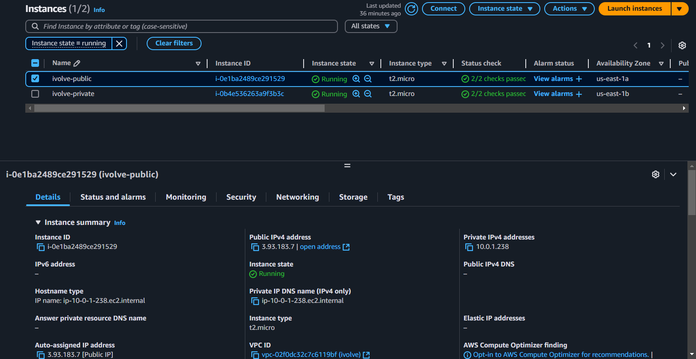
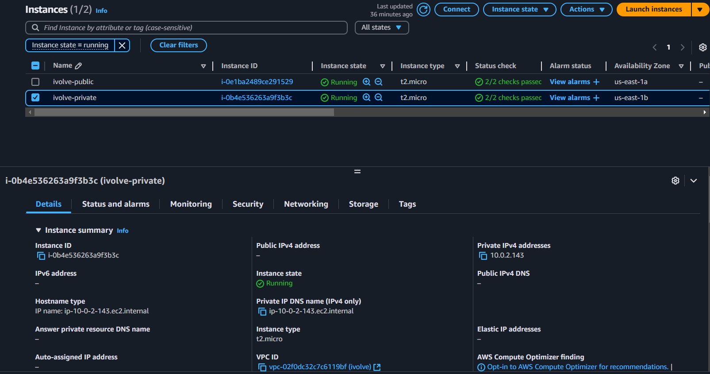
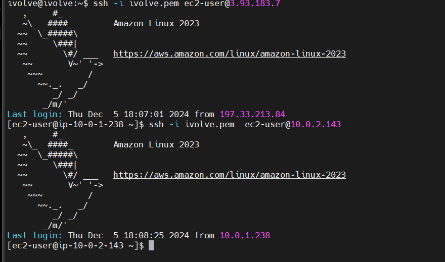

# 🚀 Launching an EC2 Instance on AWS

## 🌟 Overview
This project sets up an **AWS Virtual Private Cloud (VPC)** with **public and private subnets**, launches **EC2 instances** in each subnet, and configures **secure SSH access** to the private instance using a **bastion host**.

📌 **Key Features:**
✅ **VPC with Public & Private Subnets**  
✅ **Bastion Host for Secure SSH Access**  
✅ **Internet Gateway & Route Tables**  
✅ **Security Groups for Controlled Access**  

---

## 🏗 Infrastructure Components

### 🔹 **1. VPC Setup**
- **Name:** `ivolve-vpc`
- **IPv4 CIDR Block:** `10.0.0.0/16`

### 🔹 **2. Subnets**
- **🌍 Public Subnet:**  
  - **Name:** `ivolve-public-subnet`  
  - **CIDR Block:** `10.0.1.0/24`  
- **🔒 Private Subnet:**  
  - **Name:** `ivolve-private-subnet`  
  - **CIDR Block:** `10.0.2.0/24`  

### 🔹 **3. Internet Gateway (IGW)**
- **Name:** `ivolve-igw`

### 🔹 **4. Route Tables**
- **Public Route Table:** `ivolve-public-rt`  
  - Routes to **Internet Gateway** 🌐
- **Private Route Table:** `ivolve-private-rt`  
  - No public route (private-only access) 🔐

📌 

---

## 🖥 EC2 Instances

### 🔹 **1. Bastion Host (Public EC2) 🌍**
- **Name:** `ivolve-bastion-host`
- **AMI:** Amazon Linux 2
- **Subnet:** `ivolve-public-subnet`
- **Security Group:**
  - Allows **SSH (port 22)** access from **your IP**.

📌 

### 🔹 **2. Private EC2 Instance 🔐**
- **Name:** `ivolve-private-instance`
- **AMI:** Amazon Linux 2
- **Subnet:** `ivolve-private-subnet`
- **Security Group:**
  - Allows **SSH** access **only** from the **bastion host’s private IP**.

📌 

---

## ⚙️ Steps to Create the Infrastructure

### 1️⃣ **Create a VPC** 🏗
- Navigate to **AWS Management Console** → **VPC** → **Create VPC**.
- **Name:** `ivolve-vpc`
- **CIDR Block:** `10.0.0.0/16`

### 2️⃣ **Create Public & Private Subnets** 🌐
✅ **Public Subnet:**  
  - **CIDR Block:** `10.0.1.0/24`
  - **Enable Auto-assign Public IP:** Yes
✅ **Private Subnet:**  
  - **CIDR Block:** `10.0.2.0/24`

### 3️⃣ **Set Up Internet Gateway (IGW) 🌍**
- Create & attach an **IGW** named `ivolve-igw` to **ivolve-vpc**.
- Update the **public route table** to direct `0.0.0.0/0` traffic to the IGW.

### 4️⃣ **Launch Bastion Host in Public Subnet** 💻
- **AMI:** Amazon Linux 2
- **Instance Type:** t2.micro
- **Key Pair:** Use or create `ivolve-key.pem`
- **Security Group:** Allow **SSH (port 22) from your IP**.

### 5️⃣ **Launch Private EC2 Instance 🔐**
- **AMI:** Amazon Linux 2
- **Subnet:** `ivolve-private-subnet`
- **Security Group:** Allow **SSH only from the Bastion Host’s Private IP**.

---

## 🔑 SSH Access Process

### 1️⃣ **SSH into the Bastion Host**
```bash
ssh -i "ivolve-key.pem" ec2-user@<public-ec2-public-ip>
```

### 2️⃣ **SSH into the Private EC2 Instance via Bastion Host** 🔒
```bash
ssh -i "ivolve-key.pem" ec2-user@<private-ec2-private-ip>
```
📌 

---

🎉 **Your AWS EC2 infrastructure is now fully set up!** 🚀

