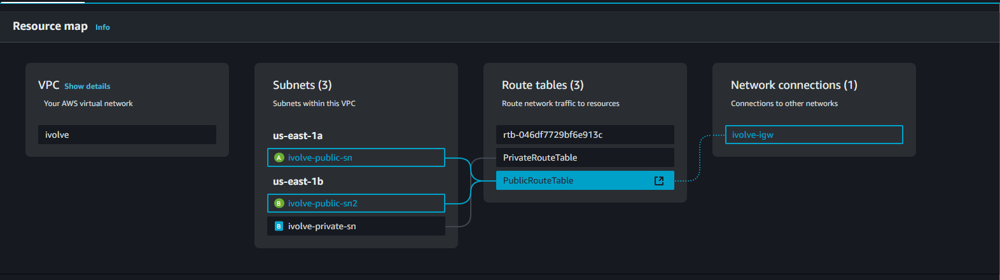
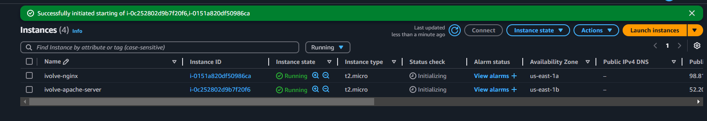
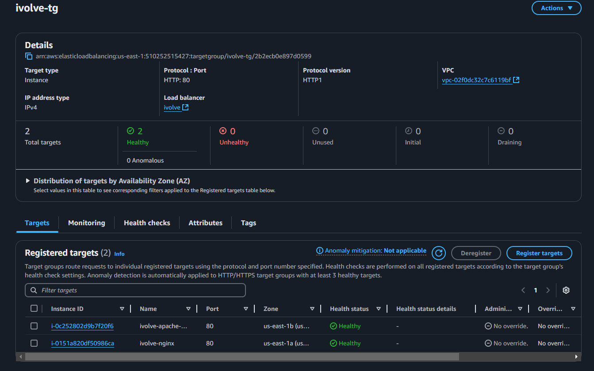
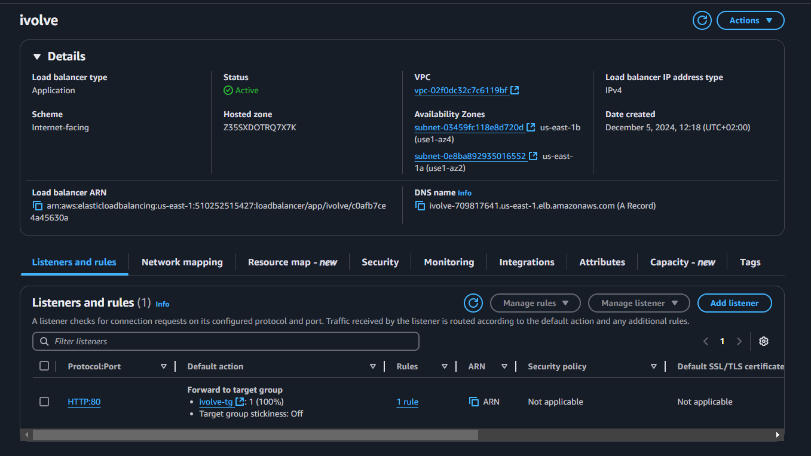
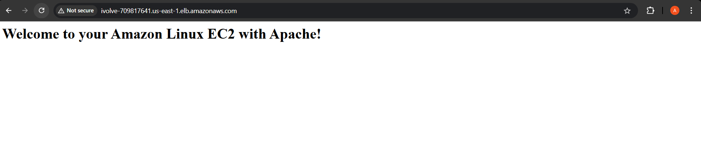
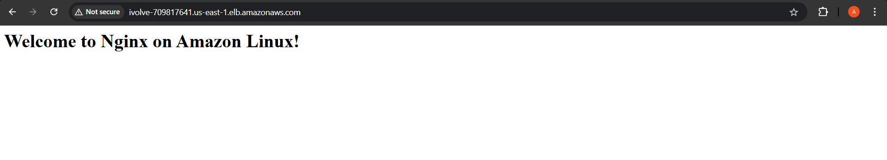

# Create AWS Load Balancer

## Objective:
Create a VPC with 2 public subnets, launch 2 EC2 instances with Nginx and Apache installed using user data, and set up a Load Balancer to distribute traffic between the two web servers.

---

## Steps Overview:
1. Create a VPC with 2 public subnets.
2. Launch 2 EC2 instances (one with Nginx, one with Apache).
3. Configure Security Groups.
4. Set up a Load Balancer.
5. Test the Load Balancer.

---

### Step 1: Create a VPC

1. **Navigate to VPC Dashboard:**
   - Go to the **AWS Management Console** → **VPC**.

2. **Create a VPC:**
   - **Name:** `ivolve-vpc`
   - **IPv4 CIDR block:** `10.0.0.0/16`

3. **Create 2 Public Subnets:**
   - **Subnet 1:**
     - **Name:** `ivolve-Public-Subnet-1`
     - **CIDR Block:** `10.0.1.0/24`
     - **Availability Zone:** Select any (e.g., `us-east-1a`)
   - **Subnet 2:**
     - **Name:** `ivolve-Public-Subnet-2`
     - **CIDR Block:** `10.0.2.0/24`
     - **Availability Zone:** Different from Subnet 1 (e.g., `us-east-1b`)

4. **Create and Attach Internet Gateway:**
   - **Name:** `Lab2-IGW`
   - Attach the IGW to the `ivolve-vpc`.

5. **Configure Route Tables:**
   - Create a new route table named `Public-RouteTable`.
   - Add a route: `0.0.0.0/0` → **Target:** `Lab2-IGW`.
   - Associate both public subnets with this route table.

---

### Step 2: Launch 2 EC2 Instances

1. **Launch EC2 Instance 1 (Nginx):**
   - **AMI:** Amazon Linux 2
   - **Instance Type:** t2.micro
   - **Subnet:** `ivolve-Public-Subnet-1`
   - **Security Group:** Allow HTTP (port 80) and SSH (port 22).
   - **User Data:**
     ```bash
     #!/bin/bash
     sudo yum update -y
     sudo yum install nginx1 -y
     sudo systemctl start nginx
     sudo systemctl enable nginx
     echo "<h1>Welcome to Nginx Server</h1>" | sudo tee /usr/share/nginx/html/index.html
     ```

2. **Launch EC2 Instance 2 (Apache):**
   - **AMI:** Amazon Linux 2
   - **Instance Type:** t2.micro
   - **Subnet:** `ivolve-Public-Subnet-2`
   - **Security Group:** Allow HTTP (port 80) and SSH (port 22).
   - **User Data:**
     ```bash
     #!/bin/bash
     sudo yum update -y
     sudo yum install httpd -y
     sudo systemctl start httpd
     sudo systemctl enable httpd
     echo "<h1>Welcome to Apache Server</h1>" | sudo tee /var/www/html/index.html
     ```



---

### Step 3: Configure Security Groups

- **Create a Security Group for Load Balancer:**
  - **Inbound Rules:** Allow HTTP (port 80) from `0.0.0.0/0`.
  - **Outbound Rules:** Allow all traffic.

- **Assign EC2 Instances Security Groups:**
  - Ensure both instances allow HTTP and SSH access.

---

### Step 4: Create a Load Balancer

1. **Navigate to EC2 Dashboard:**
   - Go to **Load Balancers** → **Create Load Balancer**.

2. **Choose Load Balancer Type:**
   - **Application Load Balancer (ALB)**.

3. **Configure the Load Balancer:**
   - **Name:** `ivolve-ALB`
   - **Scheme:** Internet-facing
   - **Listeners:** HTTP on port 80
   - **Availability Zones:** Select the zones where you created the public subnets.

4. **Add Target Group:**
   - **Name:** `ivolve-TG`
   - **Target Type:** Instance
   - Register the **two EC2 instances**.

5. **Create and Test:**
   - Click **Create Load Balancer**.
   - Once the Load Balancer is active, copy its **DNS name**.





---

### Step 5: Test the Load Balancer

1. Open a web browser.
2. Enter the **DNS name** of the Load Balancer.
3. Refresh the page multiple times:
   - You should see responses from both the **Nginx** and **Apache** servers (load-balanced).


---

### Cleanup (Optional):
- Terminate the EC2 instances.
- Delete the Load Balancer and Target Group.
- Delete the VPC and associated resources.

---


