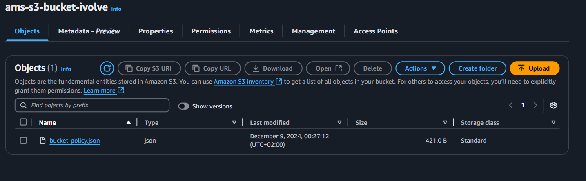
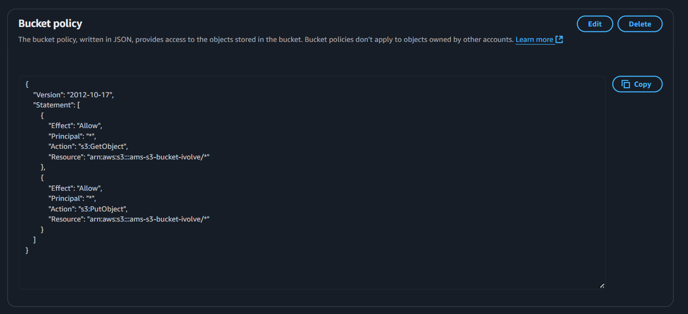
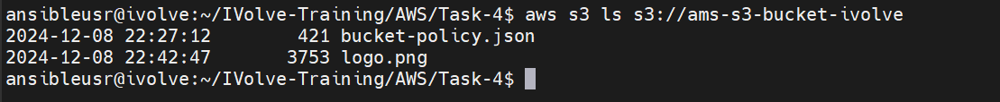

# 🚀 AWS SDK & CLI Interactions with S3

## 🎯 Objective
Use the **AWS CLI** to:
✅ Create an **S3 bucket** 🪣  
✅ Configure **permissions & policies** 🔐  
✅ Upload & download files 📂  
✅ Enable **versioning & logging** 🔄  

---

## ✅ Prerequisites

🔹 **Install & Configure AWS CLI** 🌍
```bash
aws configure
```
📌 **Enter your AWS credentials when prompted.**

🔹 **IAM User Permissions Required** 🎟️
- `s3:CreateBucket`
- `s3:PutBucketPolicy`
- `s3:PutBucketVersioning`
- `s3:PutBucketLogging`
- `s3:PutObject`
- `s3:GetObject`

---

## 🏗️ Step-by-Step Guide

### 1️⃣ Create an S3 Bucket & Modify Public ACLs
```bash
aws s3api create-bucket --bucket ams-s3-bucket-ivolve --region us-east-1
aws s3api put-public-access-block --bucket ams-s3-bucket-ivolve --public-access-block-configuration BlockPublicAcls=false
```
📌 

---

### 2️⃣ Apply a Bucket Policy 🛡️

🔹 **Create the Policy File**
```bash
vim bucket-policy.json
```
🔹 **Insert the following JSON:**
```json
{
    "Version": "2012-10-17",
    "Statement": [
        {
            "Effect": "Allow",
            "Principal": "*",
            "Action": "s3:GetObject",
            "Resource": "arn:aws:s3:::ams-s3-bucket-ivolve/*"
        },
        {
            "Effect": "Allow",
            "Principal": "*",
            "Action": "s3:PutObject",
            "Resource": "arn:aws:s3:::ams-s3-bucket-ivolve/*"
        }
    ]
}
```
🔹 **Apply the Policy**
```bash
aws s3api put-bucket-policy --bucket ams-s3-bucket-ivolve --policy file://bucket-policy.json
```
📌 

---

### 3️⃣ Enable Versioning 🔄
```bash
aws s3api put-bucket-versioning --bucket ams-s3-bucket-ivolve --versioning-configuration Status=Enabled
```

---

### 4️⃣ Enable Logging 📝
```bash
aws s3api put-bucket-logging --bucket ams-s3-bucket-ivolve --bucket-logging-status '{
    "LoggingEnabled": {
        "TargetBucket": "ams-s3-bucket-ivolve",
        "TargetPrefix": "logs/"
    }
}'
```

---

### 5️⃣ Upload & Download Files 📂

✅ **Upload a File:**
```bash
aws s3 cp bucket-policy.json s3://ams-s3-bucket-ivolve/bucket-policy.json
```
✅ **Download a File:**
```bash
aws s3 cp s3://ams-s3-bucket-ivolve/bucket-policy.json bucket-policy.json
```

---

### 6️⃣ List Files in the Bucket 📋
```bash
aws s3 ls s3://ams-s3-bucket-ivolve
```
📌 

---

🎉 **AWS CLI S3 Setup & Management Complete!** 🚀

