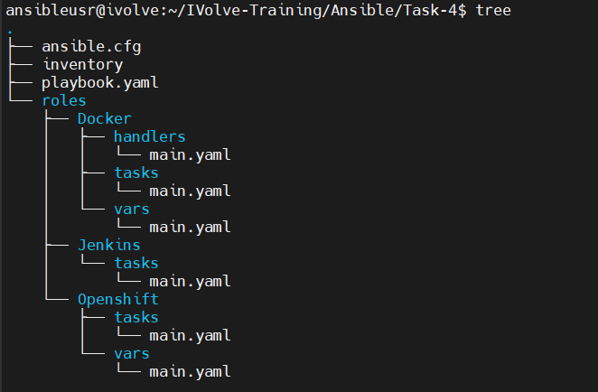

# 🚀 Ansible Roles for Application Deployment

## 🎯 Overview
This project leverages **Ansible Roles** to automate the installation of:
✅ **Docker** 🐳  
✅ **Jenkins** 🛠️  
✅ **OpenShift CLI (`oc`)** 🔧  

📌 **Why Use Ansible Roles?**
- **Modular & Reusable** 🏗️
- **Easier Management** 📂
- **Follows Best Practices** ✅

---

## 📂 Project Structure

The directory follows Ansible best practices:

📌 

---

## 🛠 How to Use This Project

### 1️⃣ Define the Inventory 📋
Create an `inventory` file to define target hosts:

```ini
[hosts]
192.168.19.132
192.168.19.133
18.209.70.116
```

---

### 2️⃣ Configure `ansible.cfg` ⚙️
Create an `ansible.cfg` file to define configurations:

```ini
[defaults]
inventory = ./inventory 
remote_user = ansibleusr 
ask_pass = false 

[privilege_escalation]
become = true 
become_method = sudo 
become_user = root 
become_ask_pass = false
```
📌 **This ensures proper privilege escalation and remote execution settings.**

---

### 3️⃣ Run the Playbook 🚀
Execute the playbook to install **Docker, Jenkins, and OpenShift CLI**:
```bash
ansible-playbook playbook.yaml -i inventory
```
📌 **This will apply the Ansible roles to all hosts in the inventory.**

---

### 4️⃣ Verify Installations 🔍

✅ **Check Docker installation:**
```bash
docker --version
```
✅ **Verify Jenkins is accessible:**
```bash
http://<server-ip>:8080
```
✅ **Confirm OpenShift CLI installation:**
```bash
oc version
```

---

🎉 **Congratulations! Your applications are now deployed using Ansible Roles.** 🚀

