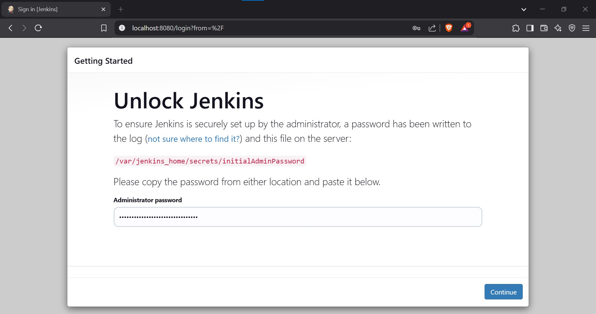
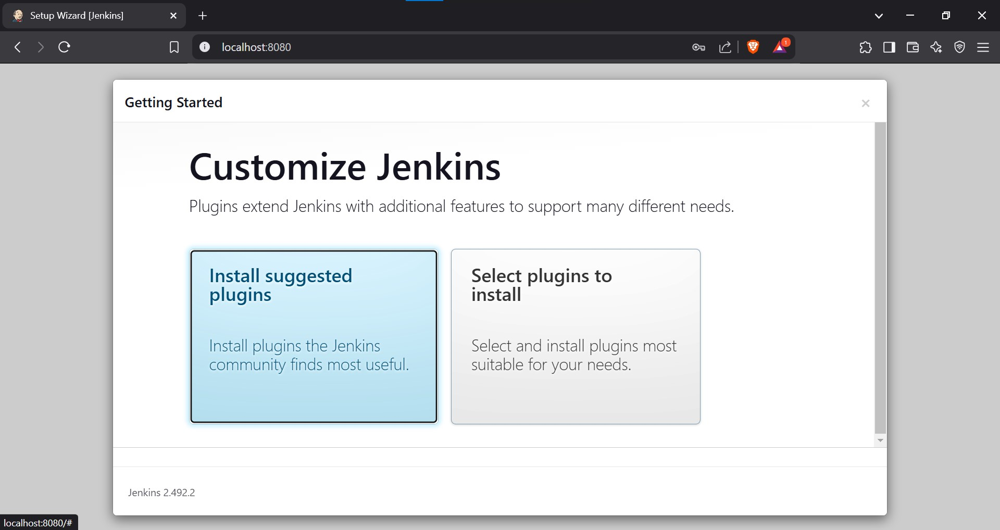

# Jenkins Installation

## Objective

Install Jenkins as a container on a Linux system using Docker.

---

## Steps

### 1. Pre-requisites

- **Update System Packages**

```bash
sudo apt update -y && sudo apt upgrade -y
```

- **Install Docker**

```bash
sudo apt install docker.io -y
```

- **Enable and Start Docker Service**

```bash
sudo systemctl enable --now docker
```

- **Verify Docker Installation**

```bash
docker --version
```

### 2. Install Jenkins

1. **Pull the Jenkins Image**

```bash
sudo docker pull jenkins/jenkins:lts
```

2. **Run the Jenkins Container**

```bash
sudo docker run -d \
  --name jenkins \
  -p 8080:8080 -p 50000:50000 \
  -v jenkins_home:/var/jenkins_home \
  --restart unless-stopped \
  jenkins/jenkins:lts
```

3. **Verify Jenkins Container is Running**

```bash
sudo docker ps
```

### 3. Configure Jenkins

1. **Access Jenkins Web Interface**

   - Open a browser and go to: `http://localhost:8080`

 

2. **Retrieve Admin Password**

```bash
sudo docker exec jenkins cat /var/jenkins_home/secrets/initialAdminPassword
```

3. **Complete Jenkins Setup**

   - Use the retrieved password to log in.
   - Install recommended plug-ins.
   - Create an admin account.




### 4. Post-Installation Steps

- **Manage Jenkins Settings**
  - Navigate to `Manage Jenkins` > `Manage Plugins` to install additional plugins.
- **Set Up SSH for Automation (Optional)**

```bash
sudo apt install -y openssh-server
```

- **Restart Jenkins if Needed**

```bash
sudo docker restart jenkins
```

---

This completes the Jenkins installation and initial configuration.

