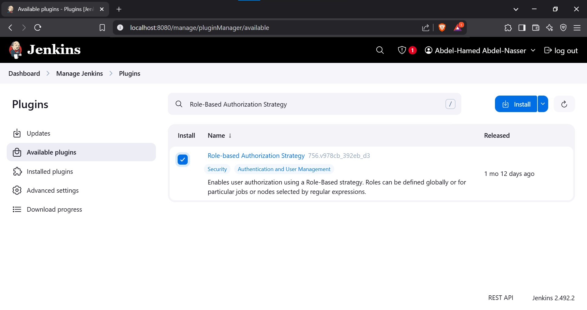
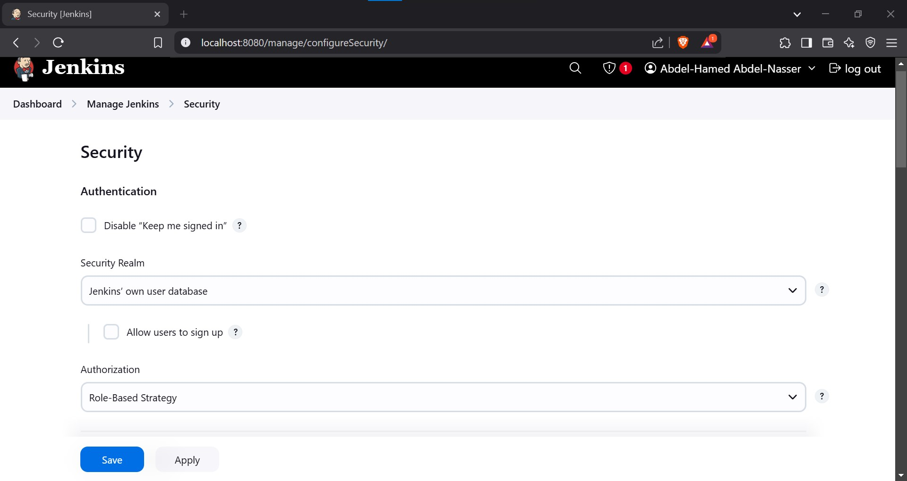
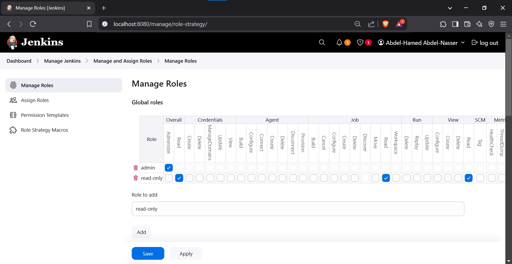
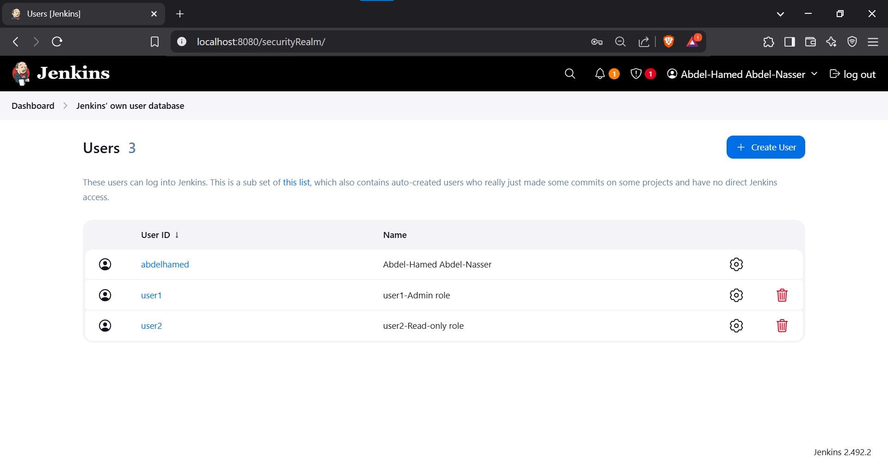
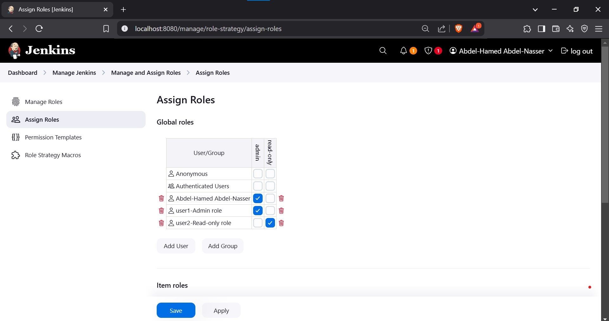
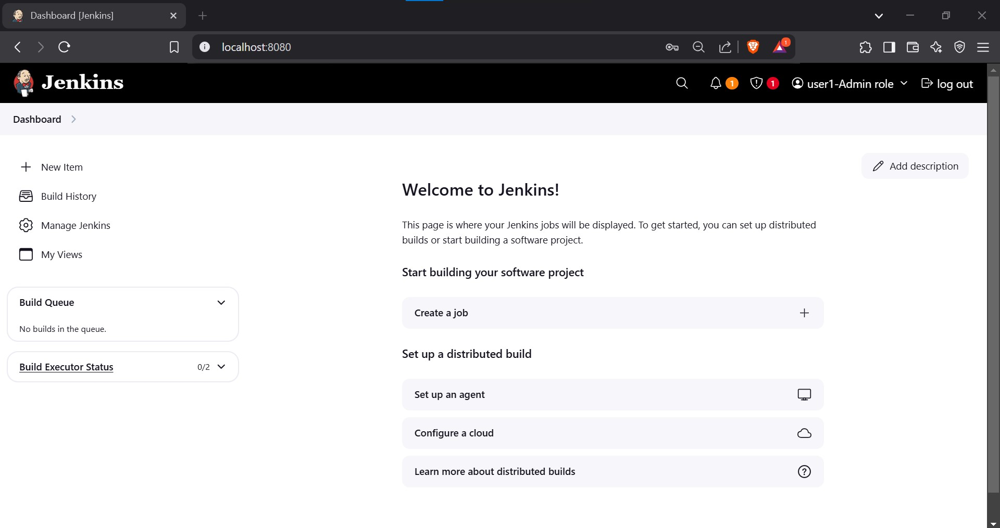
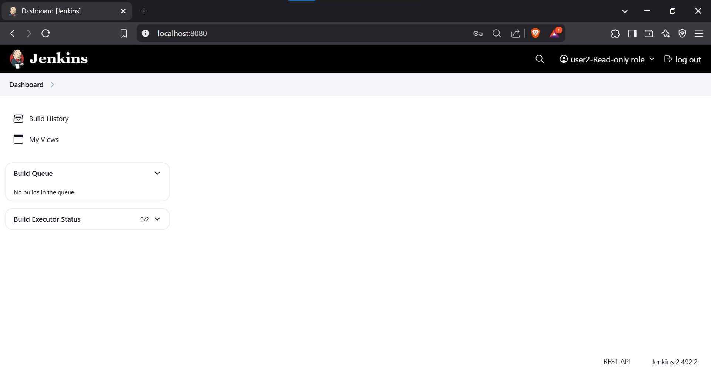

# Role-Based Authorization

## Objective
- Create two users: **user1** and **user2**.
- Assign the **admin** role to **user1**.
- Assign the **read-only** role to **user2**.

---

## Prerequisites

1. **Ensure Jenkins is Installed and Running**
   - Jenkins should be set up and accessible.

2. **Install the Role-Based Authorization Strategy Plugin**
   - Navigate to **Jenkins Dashboard > Manage Jenkins > Plugin Manager**.
   - Install the **Role-Based Authorization Strategy** plugin.

  
---

## Steps

### 1. Configure Role-Based Authorization

1. **Change Authorization Strategy**
   - Go to **Jenkins Dashboard > Manage Jenkins > Configure Global Security**.
   - Under **Authorization**, select **Role-Based Strategy**.
   - Save the changes.
  

2. **Access Role Management**
   - Navigate to **Manage Jenkins > Manage and Assign Roles > Manage Roles**.

---

### 2. Create Roles

1. **Admin Role**
   - Add a role named `admin`.
   - Under **Permissions**, enable **all permissions**.

2. **Read-Only Role**
   - Add a role named `read-only`.
   - Enable only **view-related** permissions:
     - **Overall**: Read
     - **Job**: Read
     - **View**: Read
  
---

### 3. Create Users

1. **Add Users**
   - Navigate to **Manage Jenkins > Manage Users**.
   - Create the following users:
     - **user1** (Admin role)
     - **user2** (Read-only role)
  
---

### 4. Assign Roles to Users

1. **Assign Roles**
   - Navigate to **Manage Jenkins > Manage and Assign Roles > Assign Roles**.
   - Assign the `admin` role to **user1**.
   - Assign the `read-only` role to **user2**.
  
---

### 5. Test User Permissions

1. **Verify user1 (Admin)**
   - Log in as **user1**.
   - Ensure full access to all Jenkins functionalities.
  

2. **Verify user2 (Read-Only)**
   - Log in as **user2**.
   - Confirm restricted access, allowing only viewing but no modifications or builds.
  
---

