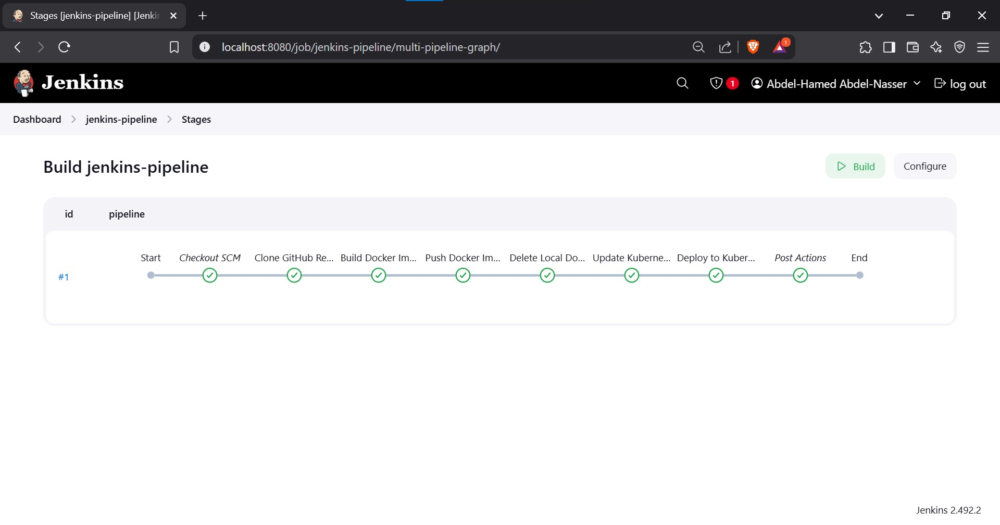

# Jenkins Pipeline for Application Deployment

## 🚀 Objective
Automate application deployment using Jenkins by implementing the following steps:

- Build a Docker image from the GitHub repository.
- Push the Docker image to Docker Hub.
- Update the image version in `deployment.yaml`.
- Deploy the application to a Kubernetes cluster.
- Implement post-action steps in the `Jenkinsfile`.

---

## ✅ Prerequisites

### 🛠 Required Tools & Accounts
- **Jenkins** (Installed & Configured)
- **Docker Hub Account**
- **Kubernetes Cluster** (Minikube, Docker Desktop, GKE, EKS, AKS)
- **GitHub Repository** (With Application Code, Dockerfile, and `deployment.yaml`)

### 📌 Jenkins Plugins
Ensure the following plugins are installed:
- Pipeline
- Docker Pipeline
- Kubernetes CLI
- Config File Provider
- Git
- Credentials
- Credentials Binding

---

## 🏗 Setup Instructions

### 🔹 1. Install and Configure Jenkins

#### 1.1 Update System Packages
```bash
sudo apt update && sudo apt upgrade -y
```

#### 1.2 Install Java (Required for Jenkins)
```bash
sudo apt install openjdk-17-jdk -y
```

#### 1.3 Add Jenkins GPG Key
```bash
curl -fsSL https://pkg.jenkins.io/debian-stable/jenkins.io-2023.key | sudo tee /usr/share/keyrings/jenkins-keyring.asc > /dev/null
```

#### 1.4 Add Jenkins Repository
```bash
echo "deb [signed-by=/usr/share/keyrings/jenkins-keyring.asc] https://pkg.jenkins.io/debian-stable binary/" | sudo tee /etc/apt/sources.list.d/jenkins.list > /dev/null
```

#### 1.5 Update Package List & Install Jenkins
```bash
sudo apt update
sudo apt install jenkins -y
sudo systemctl start jenkins
sudo systemctl enable jenkins
```

#### 1.6 Retrieve Jenkins Admin Password
```bash
sudo cat /var/lib/jenkins/secrets/initialAdminPassword
```
Access Jenkins at `http://localhost:8080` and complete setup.

---

### 🔹 2. Create Required Credentials

#### 🔑 GitHub Credentials
- Navigate to **Manage Jenkins > Credentials > System > Global Credentials > Add Credentials**.
- Add GitHub credentials (Username/Password or SSH Key).

#### 🔑 Docker Hub Credentials
- Navigate to **Manage Jenkins > Credentials > System > Global Credentials > Add Credentials**.
- Add Docker Hub **Username and Password**.

#### 🔑 Kubernetes Service Account Token
##### Step 1: Create Service Account
```bash
kubectl create serviceaccount jenkins-sa
```

##### Step 2: Bind Service Account to Cluster Role
```bash
kubectl create clusterrolebinding jenkins-sa-binding \
  --clusterrole=cluster-admin \
  --serviceaccount=default:jenkins-sa
```

##### Step 3: Retrieve Service Account Token
```bash
kubectl get secret $(kubectl get serviceaccount jenkins-sa -o jsonpath='{.secrets[0].name}') -o jsonpath='{.data.token}' | base64 --decode
```
Save this token.

##### Step 4: Add Token to Jenkins
- Navigate to **Manage Jenkins > Credentials > System > Global Credentials > Add Credentials**.
- **Kind**: Secret text
- **Secret**: Paste the token
- **ID**: `k8s-service-account-token`
- **Description**: Kubernetes cluster access token

📷 

---

### 🔹 3. Create a Pipeline Project

1. Navigate to **Jenkins Dashboard > New Item**.
2. Enter pipeline name (**Jenkins-Pipeline**), select **Pipeline**.
3. Configure:
   - **Definition**: Pipeline script from SCM
   - **SCM**: Git
   - **Repository URL**: `https://github.com/abdelhamed-4A/NTI-IVolve-Training.git`
   - **Branch**: `main`
   - **Script Path**: `Jenkins/Task-3/Jenkinsfile`
   - **Credentials**: Select GitHub credentials

📷 

---

## 🔄 Pipeline Stages

1. **Clone GitHub Repository** 📥
   - Retrieves source code and Kubernetes manifests.

2. **Build Docker Image** 🏗️
   - Uses Dockerfile to build the application image.

3. **Push Docker Image** 🚀
   - Uploads the image to Docker Hub.

4. **Delete Local Docker Image** 🧹
   - Frees space by removing the local Docker image.

5. **Update Kubernetes Deployment** 📝
   - Modifies `deployment.yaml` with the new Docker image version.

6. **Deploy to Kubernetes** 🚢
   - Applies `deployment.yaml` to the Kubernetes cluster.

📷 
📷 

---

## ▶️ How to Run

### 🔹 Manually Trigger Pipeline
- Start the pipeline from **Jenkins Dashboard**.

### 🔹 Automate with GitHub Webhook
- Configure webhook to trigger Jenkins on repository updates.

### 🔹 Verify Deployment
Check Kubernetes deployment:
```bash
kubectl get deployments
kubectl get pods
```

📷 

---

## ⚠️ Troubleshooting

### ❌ Docker Build Fails
- Ensure `Dockerfile` and `static_website/` exist in the correct location.

### ❌ Docker Push Fails
- Verify Docker Hub credentials and correct image naming.

### ❌ Kubernetes Deployment Fails
- Check if `deployment.yaml` exists and is correctly formatted.
- Ensure the Kubernetes cluster is running.

### ❌ kubectl Connection Refused
- Verify Kubernetes cluster status and correct `kubeconfig` setup.

---

✅ **Now your Jenkins pipeline is ready to automate deployments!** 🎯

