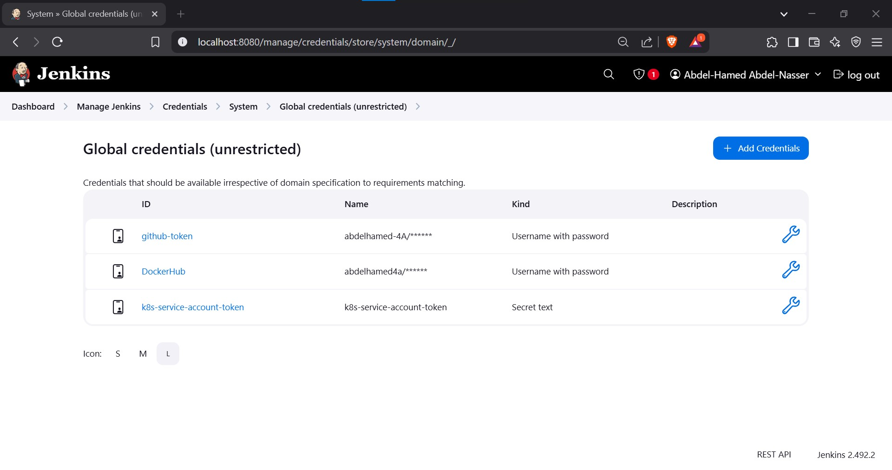

# Jenkins Pipeline for Application Deployment

## Objective
Create a Jenkins pipeline that automates the following processes:

- Build a Docker image from a Dockerfile in the provided GitHub repository.
- Push the Docker image to Docker Hub.
- Update the new image version in `deployment.yaml`.
- Deploy the application to a Kubernetes cluster.
- Include post-action steps in the `Jenkinsfile`.

## Prerequisites

### Tools and Accounts
- **Jenkins**: Installed and configured.
- **Docker Hub Account**: To push Docker images.
- **Kubernetes Cluster**: A running cluster (e.g., Minikube, Docker Desktop, GKE, EKS, AKS).
- **GitHub Repository**: Contains the application code, Dockerfile, and `deployment.yaml`.

### Jenkins Plugins
Ensure the following plugins are installed in Jenkins:
- Pipeline
- Docker Pipeline
- Kubernetes CLI
- Config File Provider
- Git
- Credentials
- Credentials Binding

---

## Setup Instructions

### 1. Install and Configure Jenkins

#### 1.1 Update System Packages
```bash
sudo apt update && sudo apt upgrade -y
```

#### 1.2 Install Java
Jenkins requires Java. Install it using:
```bash
sudo apt install openjdk-17-jdk -y
```

#### 1.3 Add Jenkins GPG Key
```bash
curl -fsSL https://pkg.jenkins.io/debian-stable/jenkins.io-2023.key | sudo tee /usr/share/keyrings/jenkins-keyring.asc > /dev/null
```

#### 1.4 Add Jenkins Repository
```bash
echo "deb [signed-by=/usr/share/keyrings/jenkins-keyring.asc] https://pkg.jenkins.io/debian-stable binary/" | sudo tee /etc/apt/sources.list.d/jenkins.list > /dev/null
```

#### 1.5 Update Package List
```bash
sudo apt update
```

#### 1.6 Install and Start Jenkins
```bash
sudo apt install jenkins -y
sudo systemctl start jenkins
sudo systemctl enable jenkins
```

#### 1.7 Configure Jenkins
Access the Jenkins web interface at `http://localhost/:8080`.

Retrieve the admin password:
```bash
sudo cat /var/lib/jenkins/secrets/initialAdminPassword
```
Complete the setup wizard:
- Install recommended plugins.
- Create an admin account.

---

### 2. Create Required Credentials

#### 2.1 GitHub Credentials
- Go to `Manage Jenkins > Credentials > System > Global Credentials > Add Credentials`.
- Add your GitHub credentials (username/password or SSH key).

#### 2.2 Docker Hub Credentials
- Go to `Manage Jenkins > Credentials > System > Global Credentials > Add Credentials`.
- Add your Docker Hub username and password.

#### 2.3 Kubernetes Credentials Using a Service Account Token
##### Step 1: Create a Service Account in Kubernetes
```bash
kubectl create serviceaccount jenkins-sa
```

##### Step 2: Bind the Service Account to a Role with Necessary Permissions
```bash
kubectl create clusterrolebinding jenkins-sa-binding \
  --clusterrole=cluster-admin \
  --serviceaccount=default:jenkins-sa
```

##### Step 3: Retrieve the Token for the Service Account
```bash
kubectl get secret $(kubectl get serviceaccount jenkins-sa -o jsonpath='{.secrets[0].name}') -o jsonpath='{.data.token}' | base64 --decode
```
Save this token for use in Jenkins.

##### Step 4: Add Service Account Token to Jenkins
- Go to `Jenkins Dashboard > Manage Jenkins > Credentials > System > Global Credentials > Add Credentials`.
- Configure the credentials:
  - **Kind**: Secret text
  - **Secret**: Paste the service account token.
  - **ID**: Provide a unique ID (e.g., `k8s-service-account-token`).
  - **Description**: Add a description (e.g., "Service account token for Kubernetes cluster access").
- Click **OK** to save.



---

### 3. Create a Pipeline Project

1. Go to `Jenkins Dashboard > New Item`.
2. Enter a name for the pipeline (e.g., **Jenkins-Pipeline**) and select **Pipeline**.
3. Configure the pipeline:
   - **Definition**: Pipeline script from SCM.
   - **SCM**: Git.
   - **Repository URL**: `https://github.com/abdelhamed-4A/NTI-IVolve-Training.git`.
   - **Branch**: `main`.
   - **Script Path**: `Jenkins/Task-3/Jenkinsfile`.
   - **Credentials**: Select your GitHub credentials.


---

## Pipeline Stages
The Jenkins pipeline consists of the following stages:

1. **Clone GitHub Repository**:
   - Clones the repository containing the application code and Kubernetes files.

2. **Build Docker Image**:
   - Builds a Docker image from the Dockerfile.

3. **Push Docker Image**:
   - Pushes the Docker image to Docker Hub.

4. **Delete Local Docker Image**:
   - Removes the Docker image from the local machine to free up space.

5. **Update Kubernetes Deployment**:
   - Updates the `deployment.yaml` file with the new Docker image version.

6. **Deploy to Kubernetes**:
   - Applies the updated `deployment.yaml` to the Kubernetes cluster.


---

## How to Run

### Trigger the Pipeline
- Manually trigger the pipeline from the Jenkins dashboard.
- Alternatively, configure a **GitHub webhook** to trigger the pipeline automatically on code changes.

### Verify Deployment
Check the Kubernetes cluster to ensure the application is deployed:
```bash
kubectl get deployments
kubectl get pods
```


---

## Troubleshooting

### Common Issues

#### Docker Build Fails
- Ensure the `Dockerfile` and `static_website/` directory exist in the correct location.

#### Docker Push Fails
- Verify Docker Hub credentials and ensure the image name includes your Docker Hub username.

#### Kubernetes Deployment Fails
- Ensure the `deployment.yaml` file exists and is correctly formatted.
- Verify the Kubernetes cluster is running and accessible.

#### kubectl Connection Refused
- Ensure the Kubernetes cluster is running and the `kubeconfig` file is correct.

