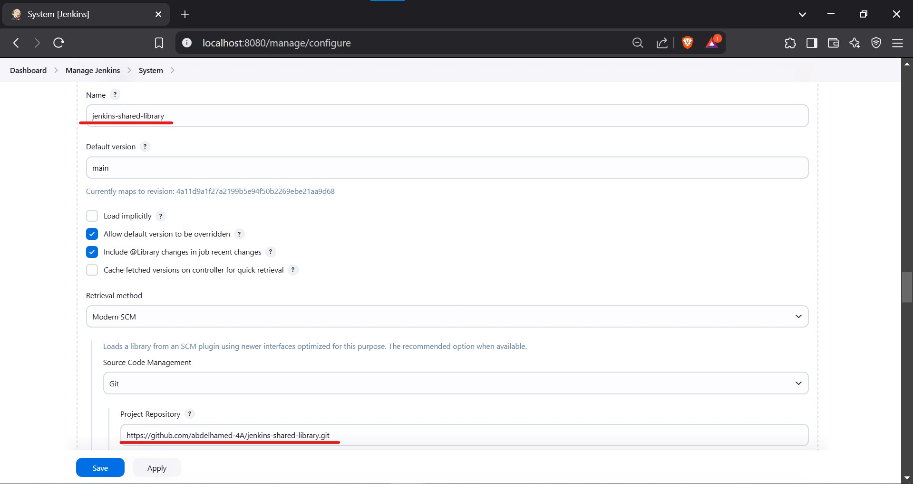
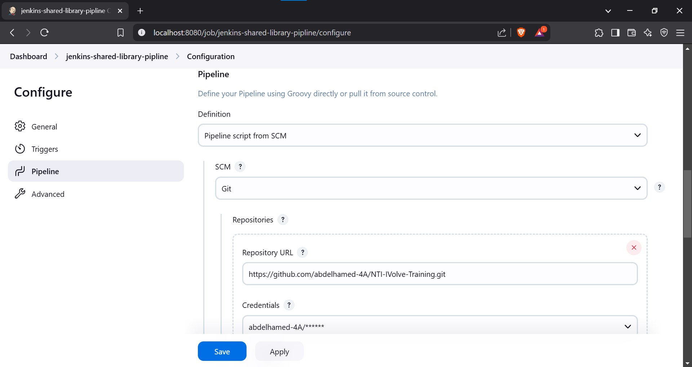
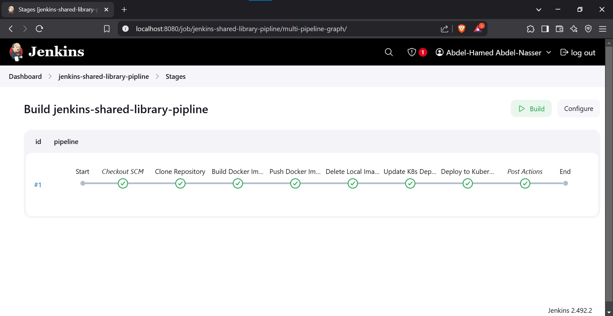

# 🚀 Jenkins Shared Libraries

## 🎯 Objective
Implement Jenkins shared libraries to enhance code reuse across pipelines. This approach ensures modularity, reusability, and cleaner pipeline definitions. The shared library will handle:
- ✅ Cloning GitHub repositories
- ✅ Building and pushing Docker images
- ✅ Deleting local Docker images
- ✅ Deploying applications to Kubernetes

---

## 🔧 Prerequisites  

1. **Jenkins Setup**: Ensure Jenkins is installed and configured.
2. **Install Required Plugins**: Pipeline Utility Plugins must be installed.

---

## 📌 Steps to Implement Jenkins Shared Libraries

### 1️⃣ Create a Shared Library Repository
1. Create a GitHub repository to store the shared library.
2. Use the following directory structure:

#### 📂 Repository Structure
```
jenkins-shared-library/
├── vars/                # Contains global pipeline functions
│   ├── dockerKubePipeline.groovy  # Example shared function
```

---

## 🛠️ How to Use

### 1️⃣ Configure Shared Library in Jenkins
- Go to **Manage Jenkins** → **Configure System** → **Global Pipeline Libraries**.
- Add a new library:
  - **Name**: `jenkins-shared-library`
  - **Default Version**: `main`
  - **Retrieval Method**: **Modern SCM**
  - **Source Code Management**: **Git**
  - **Repository URL**: `https://github.com/abdelhamed-4A/jenkins-shared-library.git`
  - **Save Configuration** ✅

🖼️ 

---

### 2️⃣ Use the Shared Library in a Jenkins Pipeline
- Go to **Jenkins Dashboard** → **New Item**.
- Enter a name for the pipeline (e.g., `jenkins-shared-library-pipeline`) and select **Pipeline**.
- Configure the pipeline:
  - **Definition**: Pipeline script from SCM.
  - **SCM**: Git.
  - **Repository URL**: `https://github.com/abdelhamed-4A/NTI-IVolve-Training.git`
  - **Branch**: `main`
  - **Script Path**: `Jenkins/Task-4/Jenkinsfile`
  - **Credentials**: Select your GitHub credentials.
  - **Save Configuration** ✅

🖼️ 

---

## 🔄 Pipeline Stages

### 🔹 1. Clone GitHub Repository 🏗️
- Clones the repository containing the application code and Kubernetes files.

### 🔹 2. Build Docker Image 🏗️
- Builds a Docker image from the Dockerfile.

### 🔹 3. Push Docker Image 📤
- Pushes the Docker image to Docker Hub.

### 🔹 4. Delete Local Docker Image 🗑️
- Removes the Docker image from the local machine to free up space.

### 🔹 5. Update Kubernetes Deployment 📄
- Updates the `deployment.yaml` file with the new Docker image version.

### 🔹 6. Deploy to Kubernetes 🚀
- Applies the updated `deployment.yaml` to the Kubernetes cluster.

🖼️ 
