# 🛠️ Kubernetes: Updating Applications & Rolling Back Changes

This guide covers **deploying NGINX**, updating it to **Apache**, checking rollout history, and rolling back to the previous version using **Kubernetes Deployment Strategies**. 🚀

---

## 📌 Objective
- Deploy **NGINX** with **3 replicas**.
- Expose NGINX via a **Service** and access it locally using **port forwarding**.
- **Update** the NGINX deployment to **Apache**.
- View the **rollout history** of the deployment.
- **Rollback** to the previous version and verify the changes.

---

## 🏗️ Step 1: Create a Namespace
```bash
kubectl create namespace lab-26
```
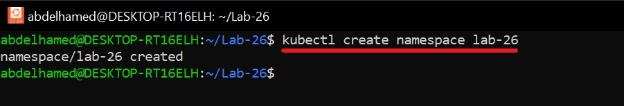

---

## 🌐 Step 2: Deploy NGINX with 3 Replicas

1️⃣ **Create the Deployment file** (`nginx.yaml`):
```yaml
apiVersion: apps/v1
kind: Deployment
metadata:
  name: nginx-deployment
  namespace: lab-26
spec:
  replicas: 3
  selector:
    matchLabels:
      app: nginx
  template:
    metadata:
      labels:
        app: nginx
    spec:
      containers:
      - name: nginx
        image: nginx:latest
        ports:
        - containerPort: 80
```

2️⃣ **Apply the deployment:**
```bash
kubectl apply -f nginx.yaml
```

3️⃣ **Verify the deployment:**
```bash
kubectl get deployments -n lab-26
kubectl get pods -n lab-26
```
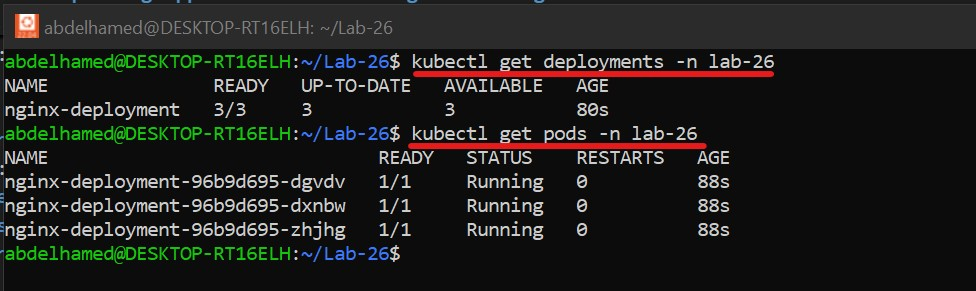

---

## 🔗 Step 3: Expose NGINX Deployment with a Service

1️⃣ **Create the Service file** (`service.yaml`):
```yaml
apiVersion: v1
kind: Service
metadata:
  name: nginx-service
  namespace: lab-26
spec:
  ports:
  - protocol: TCP
    port: 80
    targetPort: 80
  selector:
    app: nginx
```

2️⃣ **Apply the service:**
```bash
kubectl apply -f service.yaml
kubectl get svc -n lab-26
```
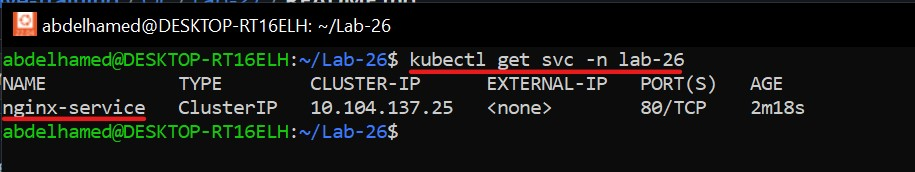

3️⃣ **Forward the service port locally:**
```bash
kubectl port-forward service/nginx-service 9090:80 -n lab-26
```
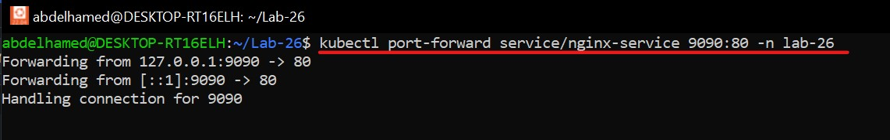

4️⃣ **Access NGINX locally:**
Open your browser and visit `http://localhost:9090`.

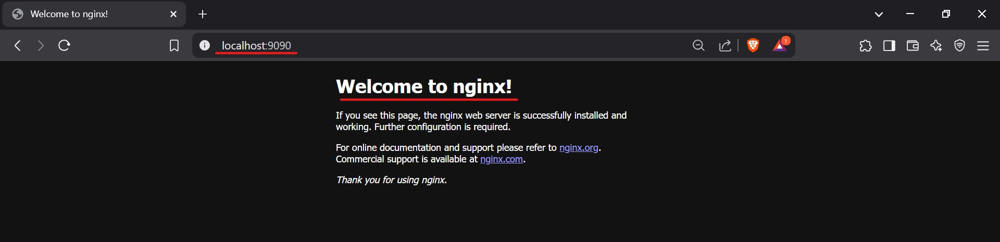

---

## 🔄 Step 4: Update Deployment Image to Apache

1️⃣ **Update the deployment to Apache:**
```bash
kubectl set image deployment/nginx-deployment nginx=httpd:latest -n lab-26
```
   - Change `nginx` to your container name and `httpd` to the new desired image
   - When you observe the creation of the new pods using the following command

   ```bash
   watch kubectl get pods
   ```

   - You will notice that new pod is created first then the old pod is deleted and this algorithm to reduce the downtime 


2️⃣ **Monitor the rollout status:**
```bash
kubectl rollout status deployment/nginx-deployment -n lab-26
```
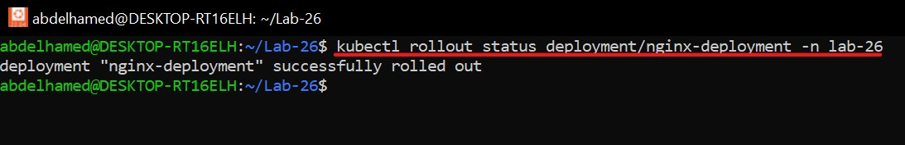

3️⃣ **Verify the updated pods:**
```bash
kubectl get pods -n lab-26 -o wide
```
   - The old pods

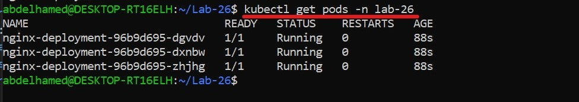

   - The new pods after the rollout ( Notice the change in the names )

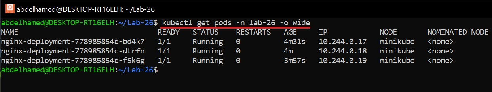


4️⃣ **Check the running image:**
```bash
kubectl describe pod <pod-name> -n lab-26
```
   - To verify that the pod is created from the new image
   
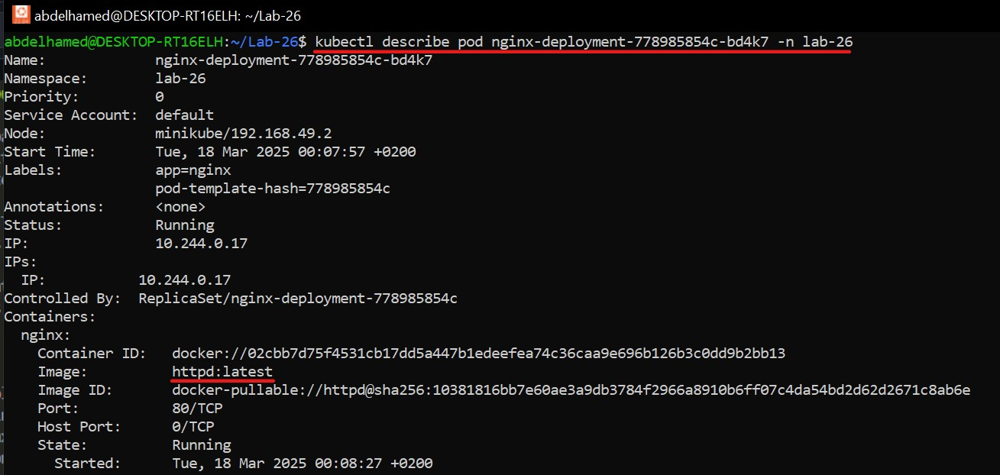

---

## 📜 Step 5: View Rollout History

1️⃣ **Check the deployment history:**
```bash
kubectl rollout history deployment/nginx-deployment -n lab-26
```
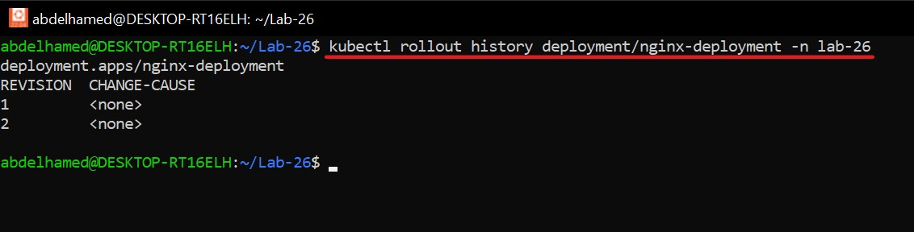

---

## 🔄 Step 6: Roll Back to Previous NGINX Image

1️⃣ **Rollback the deployment:**
```bash
kubectl rollout undo deployment/nginx-deployment -n lab-26
```

2️⃣ **Monitor the rollback process:**
```bash
kubectl get pods -n lab-26 -w
```
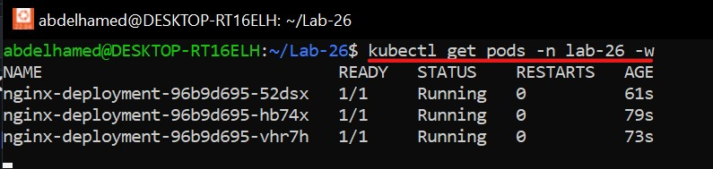

3️⃣ **Verify rollback history:**
```bash
kubectl rollout history deployment/nginx-deployment -n lab-26
kubectl describe deployment nginx-deployment -n lab-26
```
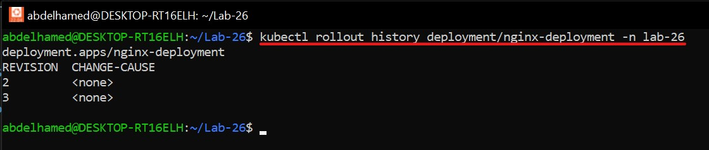
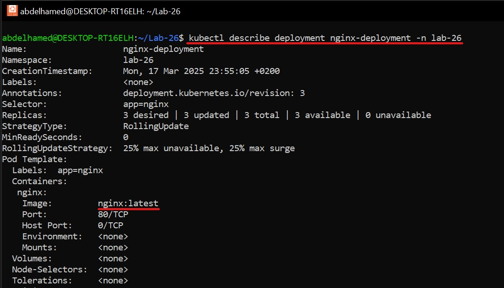
---

## 🎉 Conclusion
- Successfully deployed **NGINX** and exposed it via a **Service**.
- **Updated** NGINX to **Apache** and verified changes.
- Viewed **rollout history**.
- **Rolled back** to the previous **NGINX** version.
- Ensured **zero downtime** during updates. 🚀

