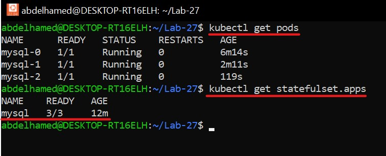
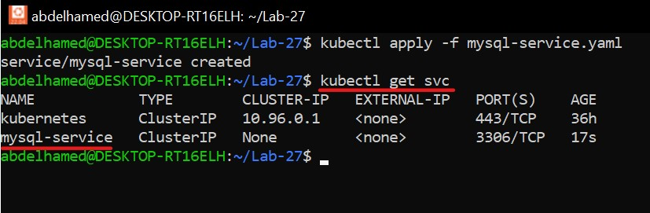
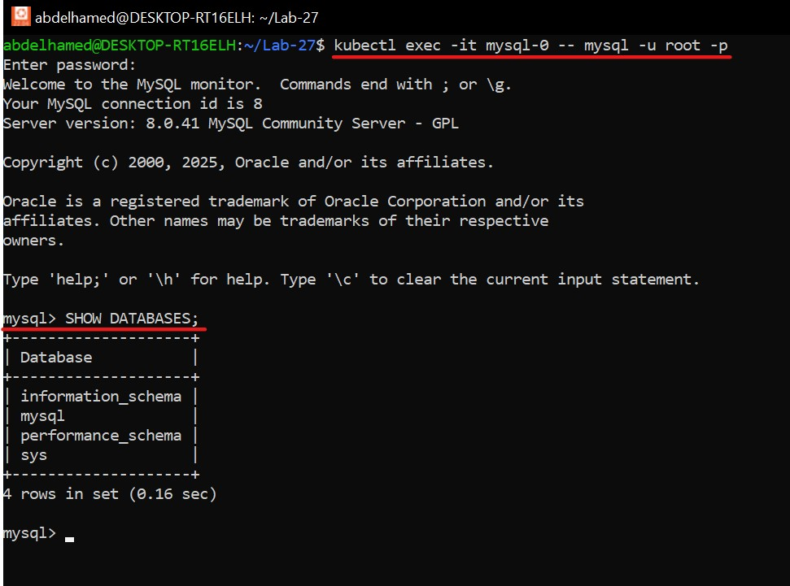

# 🏗️ Deployment vs. StatefulSet in Kubernetes

## 🎯 Objective
- **Compare** Deployment and StatefulSet.
- Create a **StatefulSet** YAML file for **MySQL**.
- Define a **Service** for MySQL StatefulSet.

---

## 📌 1. Comparison: Deployment vs. StatefulSet

| Feature              | Deployment 🚀                                                   | StatefulSet 🏗️                                              |
|----------------------|-----------------------------------------------------------------|--------------------------------------------------------------|
| **Purpose**          | Used for **stateless** applications like web servers.          | Used for **stateful** applications like databases.           |
| **Pod Identifiers**  | Pods are interchangeable; they don’t have fixed names.        | Pods have **stable network identities** and persistent storage. |
| **Scaling**          | Scales easily without maintaining order.                      | Maintains **pod creation order** and **stable identities**.  |
| **Storage**          | Does **not** automatically manage persistent storage.         | Supports **persistent storage** via PVCs.                    |
| **Pod Replacement**  | Creates a **new pod** without preserving the same storage.    | **Re-attaches storage** to a new pod after failure.          |
| **Examples**         | Web apps, APIs, microservices.                                | Databases, caching systems, distributed systems.            |

---

## 🔧 2. MySQL StatefulSet Configuration  

Create a file named **`mysql-statefulset.yaml`**:

```yaml
---
apiVersion: apps/v1
kind: StatefulSet
metadata:
  name: mysql
  labels:
    app: mysql
spec:
  selector:
    matchLabels:
      app: mysql
  serviceName: mysql-service
  replicas: 3
  template:
    metadata:
      labels:
        app: mysql
    spec:
      containers:
      - name: mysql-container
        image: mysql:8.0
        ports:
        - containerPort: 3306
          name: mysql-port
        env:
        - name: MYSQL_ROOT_PASSWORD
          valueFrom:
            secretKeyRef:
              name: mysql-secret
              key: root-password
        volumeMounts:
        - name: mysql-persistent-storage
          mountPath: /var/lib/mysql
  volumeClaimTemplates:
  - metadata:
      name: mysql-persistent-storage
    spec:
      accessModes: ["ReadWriteOnce"]
      resources:
        requests:
          storage: 2Gi
```

---

## 🌐 3. MySQL StatefulSet Service  

Create a file named **`mysql-service.yaml`**:

```yaml
---
apiVersion: v1
kind: Service
metadata:
  name: mysql-service
  labels:
    app: mysql
spec:
  ports:
  - port: 3306
    targetPort: 3306
    protocol: TCP
  clusterIP: None   # This makes the Service headless
  selector:
    app: mysql
```

💡 **Note:** `ClusterIP: None` ensures that pods in a StatefulSet are individually addressable.

---

## 🚀 4. Steps to Apply the Configuration  

### 🔑 4.1 Create a Secret for MySQL Root Password
```bash
kubectl create secret generic mysql-secret --from-literal=root-password=root-password
```

---

### 📥 4.2 Apply the StatefulSet
```bash
kubectl apply -f mysql-statefulset.yaml
```
🖼️ 

---

### 🌍 4.3 Apply the Service
```bash
kubectl apply -f mysql-service.yaml
```
🖼️ 

---

## 🔍 5. Access the MySQL Pod
Run the following command to connect to the MySQL database:
```bash
kubectl exec -it mysql-0 -- mysql -u root -p
```
When prompted for the password, enter the mysql-root-password:
```bash
root-password
```
Once connected, you can run SQL commands to verify the connection. For example:
```sql
SHOW DATABASES;
```
🖼️ 

---

## 🎯 Conclusion
✅ **Deployment** is ideal for stateless apps, while **StatefulSet** is crucial for stateful workloads.  
✅ MySQL runs as a StatefulSet with **persistent storage** and **stable network identity**.  
✅ Using `ClusterIP: None`, MySQL pods can communicate with each other efficiently.  

🚀 **Congratulations! You have successfully deployed MySQL using a StatefulSet in Kubernetes!** 🎉

