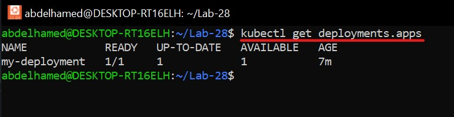
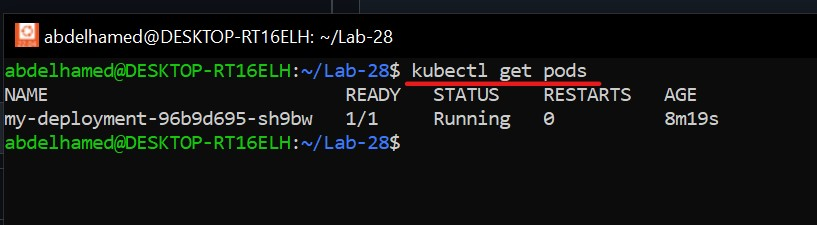
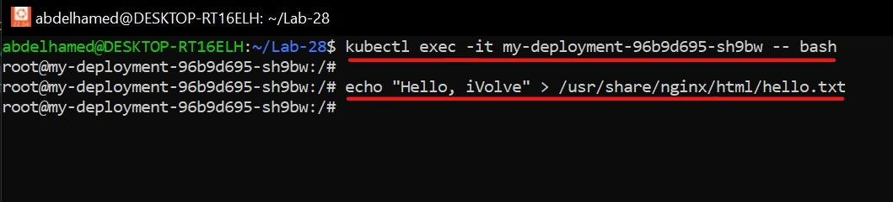
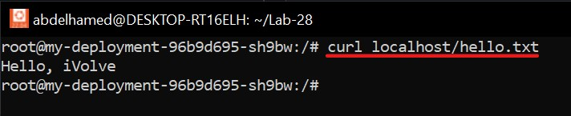
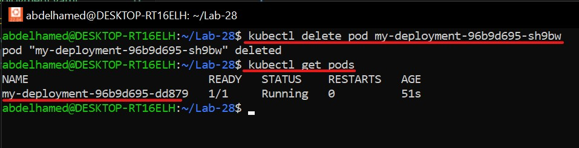
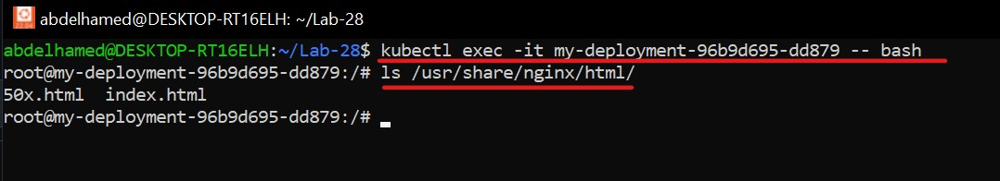
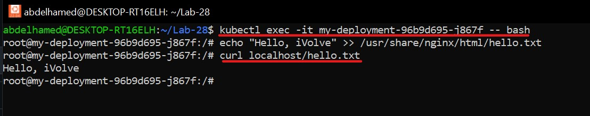
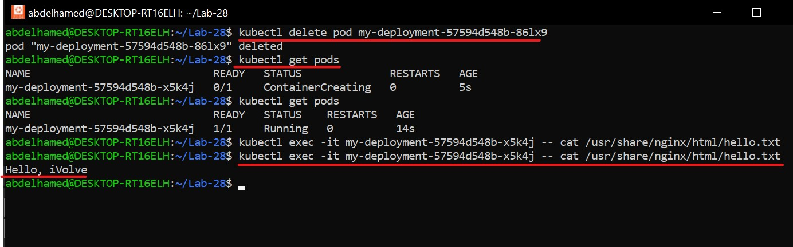

# 🔹 Storage Configuration  

## 🎯 Objective  
1️⃣ Deploy **NGINX** using a Kubernetes **Deployment**.  
2️⃣ Verify file **persistence across pod deletions** using a PVC.  
3️⃣ Compare **PersistentVolume (PV), PersistentVolumeClaim (PVC), and StorageClass**.  

---

## 🛠️ Steps  

### 1️⃣ Deploy NGINX  

📌 **Create a file named `nginx-deployment.yaml`**:  

```yaml
apiVersion: apps/v1
kind: Deployment
metadata:
  name: my-deployment
spec:
  replicas: 1
  selector:
    matchLabels:
      app: nginx
  template:
    metadata:
      labels:
        app: nginx
    spec:
      containers:
      - name: nginx
        image: nginx:latest
        ports:
        - containerPort: 80
```

📌 **Apply the deployment**  

```bash
kubectl apply -f nginx-deployment.yaml
```
🖼️ 

📌 **Verify the pod is running**  

```bash
kubectl get pods
```
🖼️ 

---

### 2️⃣ Exec into the Pod and Create a File  

```bash
kubectl exec -it my-deployment-96b9d695-sh9bw -- bash
```

```bash
echo "hello, iVolve" >> /usr/share/nginx/html/hello.txt
```
🖼️ 

📌 **Verify the file is served by NGINX:**  

```bash
curl localhost/hello.txt
```
🖼️ 

---

### 3️⃣ Delete the NGINX Pod  

```bash
kubectl delete pod <nginx-pod-name>
```
📌 **Wait for the deployment to create a new pod:**  

```bash
kubectl get pods
```
🖼️ 

📌 **Check file persistence after pod restart:**  

```bash
kubectl exec -it my-deployment-96b9d695-dd879 -- ls /usr/share/nginx/html/
```
🖼️ 

---

### 4️⃣ Create a PVC and Update the Deployment  

📌 **Create a Persistent Volume Claim** (`nginx-pvc.yaml`):  

```yaml
apiVersion: v1
kind: PersistentVolumeClaim
metadata:
  name: nginx-pvc
spec:
  accessModes:
    - ReadWriteOnce
  resources:
    requests:
      storage: 1Gi
```

📌 **Modify the deployment to attach the PVC** (`nginx-deployment.yaml`):  

```yaml
apiVersion: apps/v1
kind: Deployment
metadata:
  name: my-deployment
spec:
  replicas: 1
  selector:
    matchLabels:
      app: nginx
  template:
    metadata:
      labels:
        app: nginx
    spec:
      containers:
      - name: my-container
        image: nginx:latest
        ports:
        - containerPort: 80
        volumeMounts:
        - name: nginx-volume
          mountPath: /usr/share/nginx/html
      volumes:
      - name: nginx-volume
        persistentVolumeClaim:
          claimName: nginx-pvc
```
📌 **Apply the updated deployment**  

```bash
kubectl apply -f nginx-deployment.yaml
```

---

### 5️⃣ Verify File Persistence  

📌 **Exec into the Pod and Create the File**  

```bash
kubectl exec -it <nginx-pod-name> -- bash
```
🖼️ 

📌 **Delete the pod**  

```bash
kubectl delete pod <nginx-pod-name>
```

📌 **Verify the file in the new pod**  

```bash
kubectl exec -it <new-nginx-pod-name> -- cat /usr/share/nginx/html/hello.txt
```
🖼️ 

✅ The file **persists** across pod deletions!

---

## 🔍 6️⃣ Comparison: PV vs. PVC vs. StorageClass  

| Feature             | PersistentVolume (PV)             | PersistentVolumeClaim (PVC)         | StorageClass                                   |
|---------------------|----------------------------------|-------------------------------------|------------------------------------------------|
| **Definition**      | Cluster-wide provisioned storage | Request for storage by a pod       | Defines storage type (AWS EBS, GCP PD, etc.)   |
| **Provisioning**    | Static or dynamic               | Binds to an existing PV            | Automates PV creation                         |
| **Scope**           | Cluster-wide resource           | Namespace-specific                  | Cluster-wide                                  |
| **Access Modes**    | RWO, ROX, RWX                    | Same as PV                          | Defined by backend storage                   |
| **Use Case**        | Pre-created storage for pods    | Request for storage via claims      | Simplifies dynamic storage provisioning      |

📌 **Summary**
- **PV**: Represents provisioned storage in the cluster.
- **PVC**: Requests storage and binds to available PVs.
- **StorageClass**: Automates PV creation based on requests.

---

🎉 **Congratulations** You have successfully deployed NGINX with persistent storage using Kubernetes PVCs 🚀

