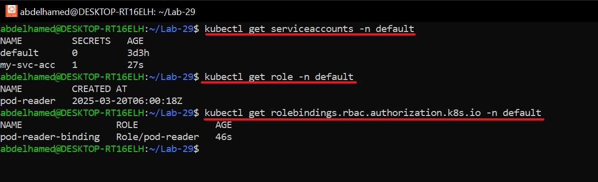
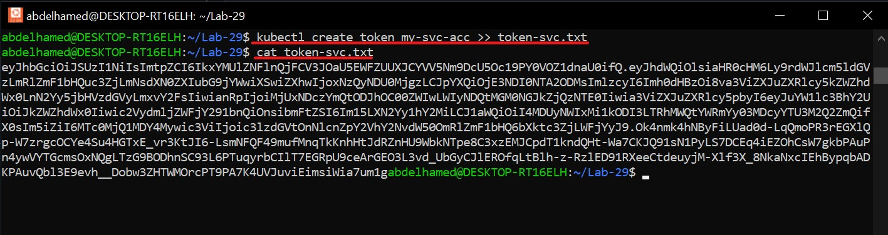
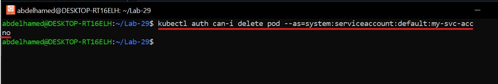

# 🔐 Kubernetes Service Account with RBAC  

## 🎯 Objective  
✅ Create a **Service Account**.  
✅ Define a **Role** named `pod-reader` with **read-only** access to pods in a namespace.  
✅ Bind the **Role** to the **Service Account** and retrieve its token.  
✅ Compare **Service Account**, **Role & RoleBinding**, and **ClusterRole & ClusterRoleBinding**.  

---

## Steps  

### 🛠️ Step 1: Create a Yaml file for Service Account - Role - RoleBinding

🔹 **Create a yaml file holds the configuration of the following**:

- `Service Account` named `my-svc-acc.yaml`
- `Role` named `pod-reader`
- `RoleBinding` named `pod-reader-binding`

```yaml
---
#Create the Service Account
apiVersion: v1
kind: ServiceAccount
metadata:
  name: my-svc-acc
  namespace: default
secrets:
  - name: svc-secret
---
#Create the Role
apiVersion: rbac.authorization.k8s.io/v1
kind: Role
metadata:
  name: pod-reader
  namespace: default
rules:
- apiGroups: [""]
  resources: ["pods"]
  verbs: ["get", "watch", "list"]

---
#Role_Binding
apiVersion: rbac.authorization.k8s.io/v1
kind: RoleBinding
metadata:
  name: pod-reader-binding
  namespace: default
subjects:
- kind: ServiceAccount
  name: my-svc-acc
  namespace: default
roleRef:
  kind: Role
  name: pod-reader
  apiGroup: rbac.authorization.k8s.io
```

- 🛠️ Apply the Yaml files

```bash
kubectl apply -f service_acc.yaml
kubectl apply -f pod-reader-role.yaml
kubectl apply -f role-binding.yaml
```

- 🕵️ Verify the created resources

```bash
kubectl get serviceaccounts -n default
kubectl get role -n default
kubectl get rolebindings.rbac.authorization.k8s.io -n default 
```
📸 Example Output:



### 🔑 Step 2: Create the Token for the Service account
1️⃣ Generate the token for the Service Account:
```bash
  kubectl create token <service-account-name> >> token-svc.txt
```

📸 Example Output:



### 🔍 Step 3: Test the Token
✅ Check if the Service Account can delete a pod:
```bash
kubectl auth can-i delete pod --as=system:serviceaccount:default:my-svc-acc
```
📸 Example Output:



🚫 Since the pod-reader Role only grants read permissions (get, watch, list), it cannot delete pods.

### 📊 Step 4: Comparison Table

| Feature             | Service Account            |     Role & RoleBinding		     | ClusterRole & ClusterRoleBinding                                               |
|---------------------|-----------------------------------|----------------------------------------|-----------------------------------------------------------|
| **Definition**      | Provides an identity for processes running in a pod.	|Grants permissions within a specific namespace.	| Grants permissions across all namespaces in the cluster.|
| **Scope**    | Namespace-specific.		              | Namespace-specific.	                     | Cluster-wide.                          |
| **Use Case**          | Used for pod-to-API communication or specific automation tasks.	         	|	Restrict actions on resources like pods, secrets, or configmaps in a single namespace.	         | Used for cluster-wide permissions (e.g., node management, persistent volume access).            |
| **Binding Mechanism**   | A Service Account used by a Jenkins pod to access Kubernetes resources.			|	Granting read-only access to pods in a namespace for a specific user.      | Granting admin access to all nodes or global secrets across namespaces. |
| **Examples**        | Pre-created or dynamically provisioned storage.	|	For pods to request storage via claims.| Simplifies dynamic provisioning of storage. |

🎉 Conclusion

✅ Successfully created a Service Account. 
✅ Assigned a Role with read-only pod access. 
✅ Bound the Role to the Service Account via RoleBinding. 
✅ Tested the Service Account token and permissions. 
✅ Compared Role vs. ClusterRole with real-world use cases.