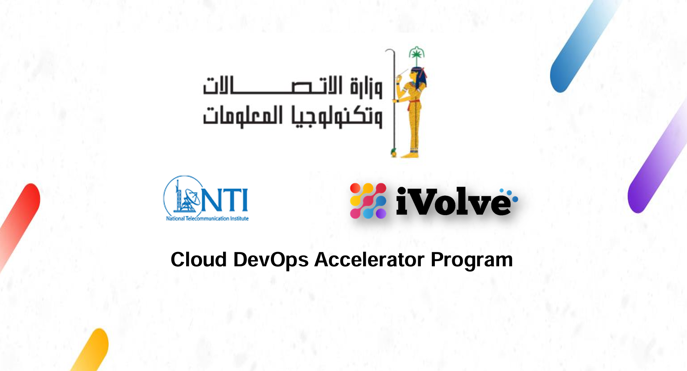

   

# 🚀 IVolve Training Journey

## 📌 Overview
Welcome to the **IVolve Technologies Lab Repository** 🎯  
This repository contains **hands-on labs and training** provided by **IVolve Technologies**, covering a **comprehensive curriculum** in:
- 🖥️ **Red Hat Linux Administration**
- ⚙️ **Ansible**
- ☁️ **AWS**
- 🌍 **Terraform**
- 🏗️ **Jenkins**
- 🏢 **Kubernetes**

📌 **Explore the repository to follow along with real-life training exercises**

---

## 📂 Contents
All labs are documented here, showcasing **practical skills and real-world scenarios.** 🔥

### 🔹 **Technologies Covered:**
- 🔴 [**Red Hat Linux Administration**](https://github.com/abdelhamed-4A/NTI-IVolve-Training/tree/main/Linux)
- 🤖 [**Ansible**](https://github.com/abdelhamed-4A/NTI-IVolve-Training/tree/main/Ansible)
- ☁️ [**AWS**](https://github.com/abdelhamed-4A/NTI-IVolve-Training/tree/main/AWS)
- 🌍 [**Terraform**](https://github.com/abdelhamed-4A/NTI-IVolve-Training/tree/main/Terraform)
- 🏗️ [**Jenkins**](https://github.com/abdelhamed-4A/NTI-IVolve-Training/tree/main/Jenkins)
- 🏢 [**Kubernetes**](https://github.com/abdelhamed-4A/NTI-IVolve-Training/tree/main/Kubernetes)

📌 **Each section contains structured labs, guides, and exercises** 🛠️

---

## 🙌 Acknowledgments
🎉 **A huge thank you to:**  
✅ **NTI** for this incredible learning opportunity.  
✅ **IVolve Technologies** for providing valuable hands-on experience.  

🚀 **Let's keep learning and evolving together** 🔥
