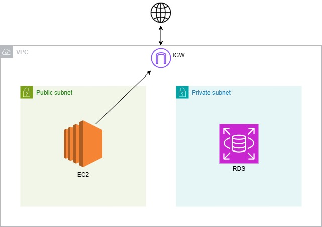
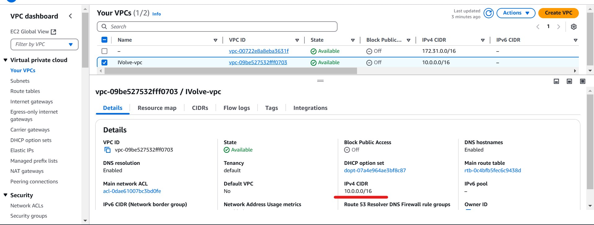
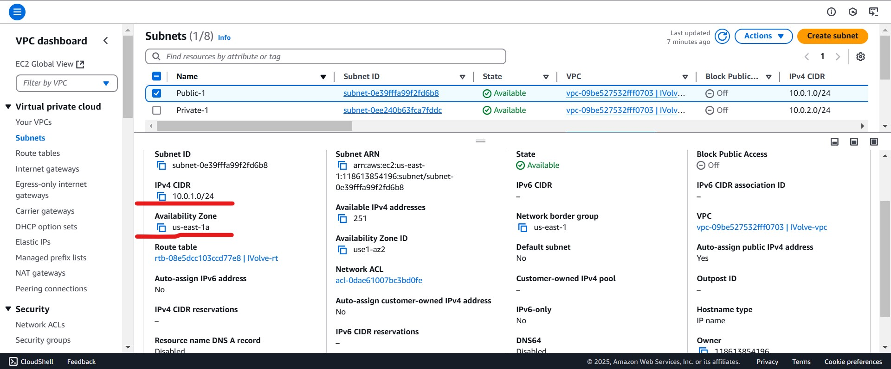
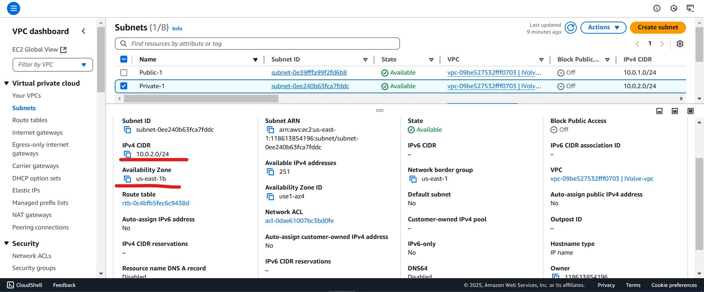
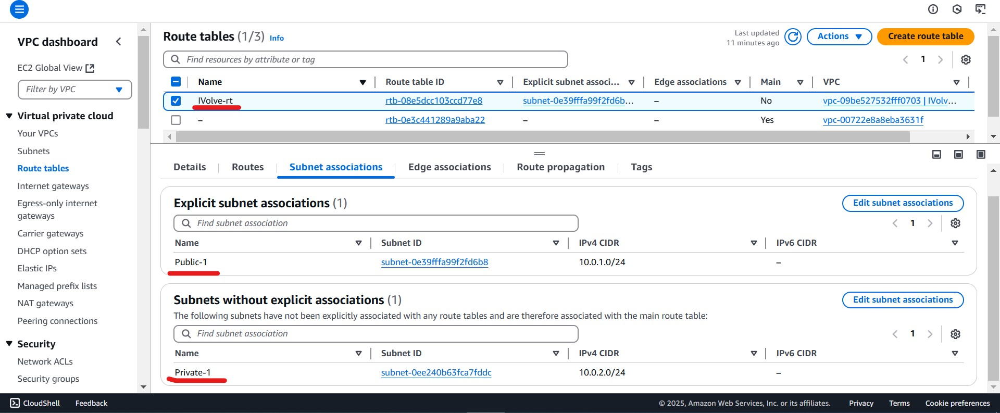
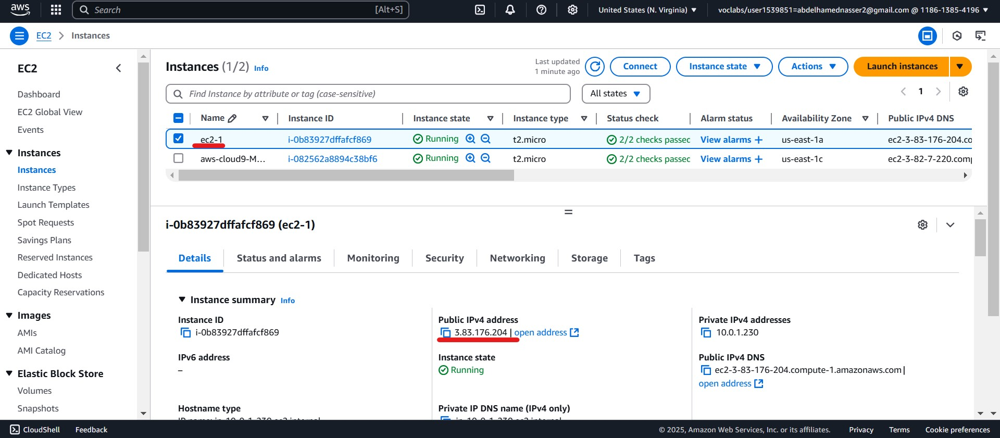
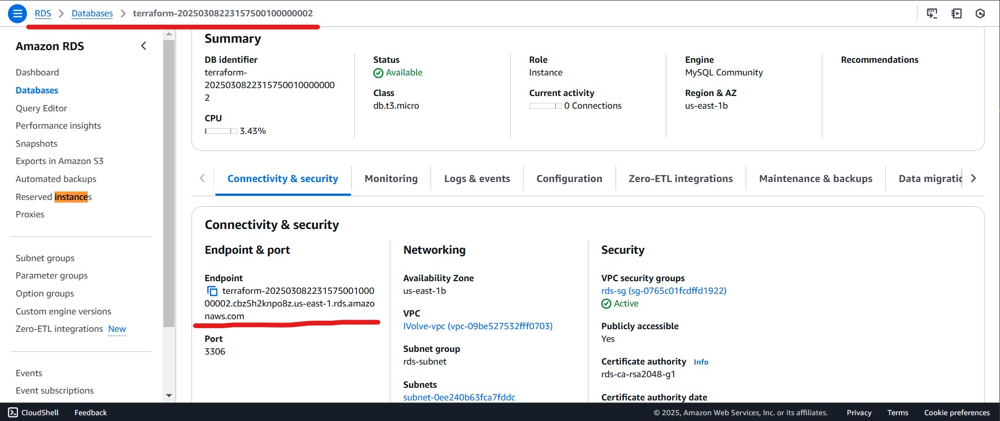

# 🌍 Multi-Tier Application Deployment with Terraform 🚀

## 🎯 Objective
1️⃣ **Create a `IVolve` VPC manually** in AWS and retrieve the VPC ID using Terraform.  
2️⃣ **Deploy a multi-tier architecture** including:  
   - 🏗️ Public and Private Subnets.
   - 🖥️ EC2 Instance.
   - 🗄️ RDS Database.
3️⃣ **Save EC2 Public IP Address** using a local provisioner.  

---

## 🏗️ Architecture
📌 

---

## ⚙️ Steps

### 1️⃣ Pre-requisites

✅ **Manually Create the VPC**:
- Use AWS Console to create a **VPC named `IVolve`**.
- Note the **region** and ensure you have **AWS credentials configured** for Terraform.

📌 

✅ **Initialize Terraform**:
```bash
mkdir -p Terraform/Task-1 && cd Terraform/Task-1
terraform init
```

---

### 2️⃣ Retrieve VPC ID 🆔
Use a **Terraform Data Block** in `main.tf` to get the VPC ID:
```hcl
data "aws_vpc" "by_tag" {
  tags = {
    Name = "IVolve-vpc"
  }
}
```

---

### 3️⃣ Define Subnets 🌐

✅ **Create a Public Subnet**:
```hcl
resource "aws_subnet" "Public-1" {
  vpc_id                  = data.aws_vpc.by_tag.id
  cidr_block              = "10.0.1.0/24"
  availability_zone       = "us-east-1a"
  map_public_ip_on_launch = true
  tags = {
    Name = "Public-1"
  }
}
```
📌 

✅ **Create a Private Subnet**:
```hcl
resource "aws_subnet" "Private-1" {
  vpc_id     = data.aws_vpc.by_tag.id
  cidr_block = "10.0.2.0/24"
  availability_zone = "us-east-1b"
  tags = {
    Name = "Private-1"
  }
}
```
📌 

---

### 4️⃣ Network Configuration 🌍

✅ **Define an Internet Gateway**:
```hcl
resource "aws_internet_gateway" "IVolve-igw" {
  vpc_id = data.aws_vpc.by_tag.id
  tags = {
    Name = "IVolve-igw"
  }
}
```
✅ **Create a Route Table**:
```hcl
resource "aws_route_table" "IVolve-rt" {
  vpc_id = data.aws_vpc.by_tag.id
  route {
    cidr_block = "0.0.0.0/0"
    gateway_id = aws_internet_gateway.IVolve-igw.id
  }
  tags = {
    Name = "IVolve-rt"
  }
}
```
📌 

✅ **Associate Public Subnet to Route Table**:
```hcl
resource "aws_route_table_association" "Public-RT" {
  subnet_id      = aws_subnet.Public-1.id
  route_table_id = aws_route_table.IVolve-rt.id
}
```

---

### 5️⃣ Security Groups 🔐

✅ **Define Security Group for EC2**:
```hcl
resource "aws_security_group" "ec2-sg" {
  name        = "ec2-sg"
  vpc_id      = data.aws_vpc.by_tag.id

  ingress {
    from_port   = 22
    to_port     = 22
    protocol    = "tcp"
    cidr_blocks = ["0.0.0.0/0"]
  }
  ingress {
    from_port   = 80
    to_port     = 80
    protocol    = "tcp"
    cidr_blocks = ["0.0.0.0/0"]
  }
  egress {
    from_port   = 0
    to_port     = 0
    protocol    = "-1"
    cidr_blocks = ["0.0.0.0/0"]
  }
}
```

✅ **Define Security Group for RDS**:
```hcl
resource "aws_security_group" "rds-sg" {
  name = "rds-sg"
  vpc_id = data.aws_vpc.by_tag.id

  ingress {
    from_port   = 3306
    to_port     = 3306
    protocol    = "tcp"
    security_groups = [aws_security_group.ec2-sg.id]
  }
}
```

---

### 6️⃣ EC2 Instance Deployment 🖥️
```hcl
resource "aws_instance" "ec2-1" {
  ami           = "ami-0e2c8caa4b6378d8c"
  instance_type = "t2.micro"
  subnet_id     = aws_subnet.Public-1.id
  security_groups = [aws_security_group.ec2-sg.id]

  provisioner "local-exec" {
    command = "echo ${self.public_ip} > ec2-ip.txt"
  }
}
```
📌 

---

### 7️⃣ Database Configuration 🗄️
✅ **Create Database Subnet Group**:
```hcl
resource "aws_db_subnet_group" "rds-subnet" {
  name       = "rds-subnet"
  subnet_ids = [aws_subnet.Private-1.id, aws_subnet.Public-1.id]
}
```
✅ **Deploy RDS Instance**:
```hcl
resource "aws_db_instance" "rds_instance" {
  allocated_storage    = 20
  engine               = "mysql"
  engine_version       = "8.0.39"
  instance_class       = "db.t3.micro"
  username             = "admin"
  password             = "Password123"
  publicly_accessible  = true
  skip_final_snapshot  = true
  vpc_security_group_ids = [aws_security_group.rds-sg.id]
  db_subnet_group_name   = aws_db_subnet_group.rds-subnet.name
}
```
📌 

---

✅ **Terraform Apply!** 🚀
```bash
terraform apply -auto-approve
```

🎉 **Your AWS Infrastructure is now live!** 🚀