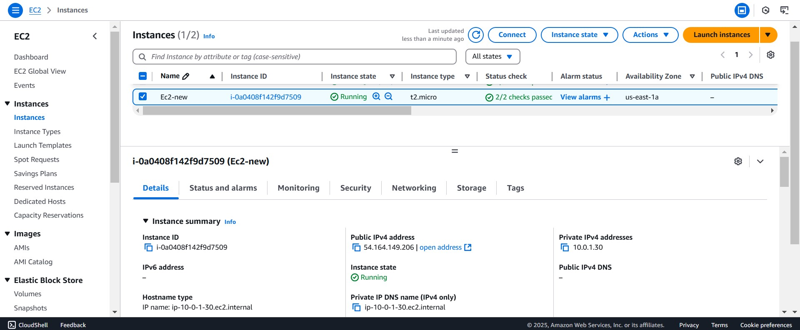
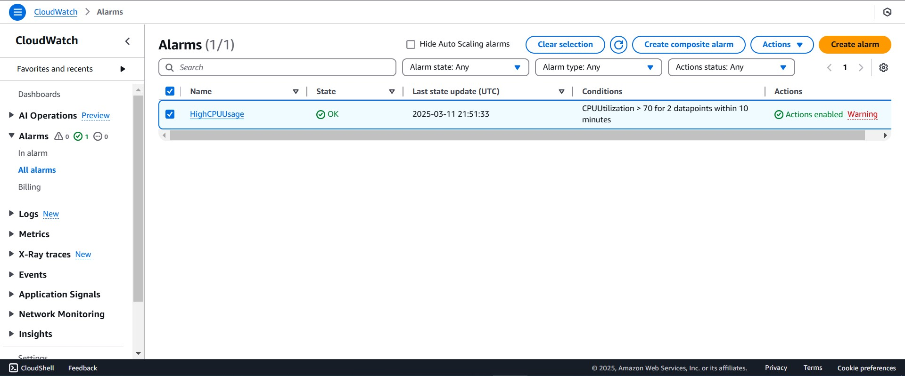
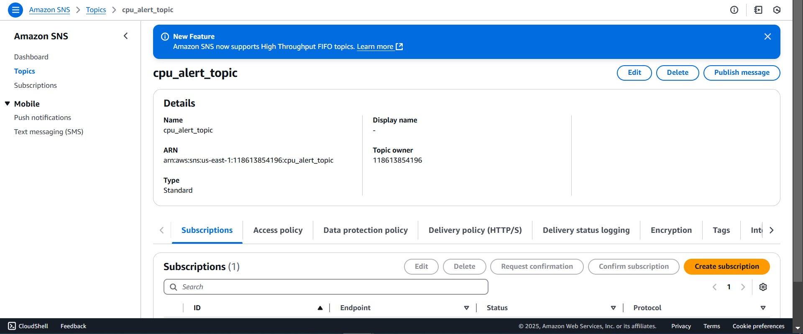
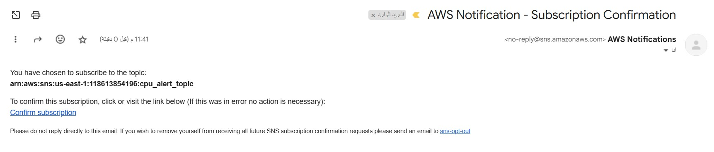

# 🌍 Remote Backend & Lifecycle Rules with Terraform 🚀

## 🎯 Objective
1️⃣ **Install NGINX** using user data on an EC2 instance.  
2️⃣ **Store Terraform state file** remotely in an **S3 backend**.  
3️⃣ **Apply `create_before_destroy` lifecycle rule** to an EC2 instance and verify behavior.  

📌 

---

## ⚙️ Features

✅ **VPC Architecture**:
- Custom **VPC** with a **public subnet**.
- **Internet Gateway (IGW)** for public access.
- **Route tables** with public routing.

✅ **Compute Resources**:
- **EC2 instance** with **Amazon Linux 2 AMI**.
- **Auto-installation of NGINX** via **user data**.
- **SSH key pair authentication**.

✅ **Security**:
- **Security Groups** with restricted **SSH/HTTP access**.
- **Encrypted S3 state storage**.

✅ **Monitoring & Alerting**:
- **CloudWatch** CPU utilization monitoring.
- **SNS email notifications** for threshold alerts.

✅ **State Management**:
- **Remote state storage in S3**.
- **State locking via DynamoDB**.

---

## 📁 Project Structure
```
terraform-project/
├── backend.tf            # S3 backend & DynamoDB locking
├── compute.tf            # EC2 instance configuration
├── monitoring.tf         # CloudWatch alarms & SNS
├── network.tf            # VPC, Subnet, IGW, Routing
├── providers.tf          # AWS provider configuration
├── security_groups.tf    # Security Group rules
├── storage.tf            # S3 bucket & DynamoDB resources
├── variables.tf          # Input variables
└── terraform.tfvars      # Variable values
```

---

## 🛠️ Steps to Deploy

### 1️⃣ Prerequisites

✅ **Set Up Remote Backend**:
- **Define an S3 bucket** for storing the Terraform state file.

📌 

✅ **Configure Remote Backend** (`backend.tf`):
```hcl
terraform {
  backend "s3" {
    bucket         = "ivolve-s3-bucket"
    key            = "terraform.tfstate"
    region         = "us-east-1"
    encrypt        = true
    dynamodb_table = "terraform-lock"
  }
}
```

---

### 2️⃣ Implement the Architecture

#### 🌐 Network Resources (`network.tf`):
```hcl
resource "aws_vpc" "vpc" {
  cidr_block = var.vpc_cidr_block
  tags = {
    Name = "VPC"
  }
}
```
```hcl
resource "aws_internet_gateway" "igw" {
  vpc_id = aws_vpc.vpc.id
  tags = {
    Name = "IGW"
  }
}
```
```hcl
resource "aws_subnet" "public_subnet" {
  vpc_id                  = aws_vpc.vpc.id
  cidr_block              = var.public_subnet_cidr_block
  availability_zone       = var.availability_zone
  map_public_ip_on_launch = true
  tags = {
    Name = "Public Subnet"
  }
}
```

#### 🖥️ Compute Resources (`compute.tf`):
```hcl
resource "aws_instance" "ec2" {
  ami                    = data.aws_ami.amazon_linux.id
  instance_type          = var.aws_ec2_size
  subnet_id              = aws_subnet.public_subnet.id
  vpc_security_group_ids = [aws_security_group.ec2_sg.id]
  key_name               = var.key_name
  user_data              = <<-EOF
                            #!/bin/bash
                            sudo yum update -y
                            sudo yum install -y nginx
                            sudo systemctl start nginx
                            sudo systemctl enable nginx
                            EOF
  lifecycle {
    create_before_destroy = true
  }
  tags = {
    Name = "Web-Server"
  }
}
```
📌 

#### 📊 Monitoring & Alerting (`monitoring.tf`):
```hcl
resource "aws_sns_topic" "cpu_alert_topic" {
  name = "cpu_alert_topic"
}
```
```hcl
resource "aws_sns_topic_subscription" "email_subscription" {
  topic_arn = aws_sns_topic.cpu_alert_topic.arn
  protocol  = "email"
  endpoint  = var.my_email
}
```
```hcl
resource "aws_cloudwatch_metric_alarm" "cpu_high_alarm" {
  alarm_name                = "HighCPUUsage"
  comparison_operator       = "GreaterThanThreshold"
  evaluation_periods        = 2
  metric_name               = "CPUUtilization"
  namespace                 = "AWS/EC2"
  period                    = 300
  statistic                 = "Average"
  threshold                 = var.threshold_cpu
  alarm_description         = "Triggers when CPU usage exceeds 70%"
  alarm_actions             = [aws_sns_topic.cpu_alert_topic.arn]
  insufficient_data_actions = []
  ok_actions                = [aws_sns_topic.cpu_alert_topic.arn]
  dimensions = {
    InstanceId = aws_instance.ec2.id
  }
}
```
📌 
📌 
📌 

---

### 3️⃣ Deploy with Terraform 🚀

✅ **Initialize Terraform**:
```bash
terraform init
```

✅ **Review Execution Plan**:
```bash
terraform plan
```

✅ **Apply Configuration**:
```bash
terraform apply -auto-approve
```

