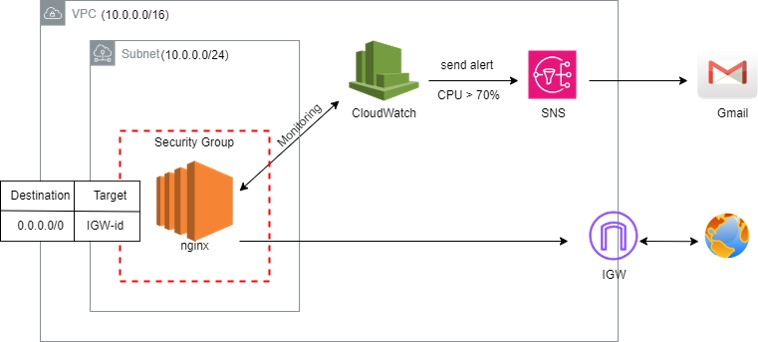
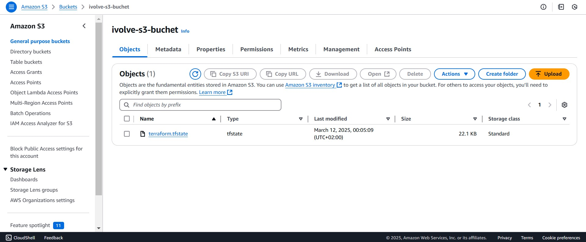

# Remote Backend and LifeCycle Rules

1. Implement the provided architecture diagram using Terraform.  
2. Store the Terraform state file in a remote backend.  
3. Configure a `create_before_destroy` lifecycle rule for an EC2 instance and verify its behavior. 
  
## Features

- **VPC Architecture**:
  - Custom VPC with public subnet
  - Internet Gateway (IGW) for public access
  - Route tables with public routing
- **Compute Resources**:
  - EC2 instance with Amazon Linux 2 AMI
  - Auto-installed NGINX web server via user data
  - SSH key pair authentication
- **Security**:
  - Security Group with restricted SSH/HTTP access
  - Encrypted S3 state storage
- **Monitoring & Alerting**:
  - CloudWatch CPU utilization monitoring
  - SNS email notifications for thresholds
- **State Management**:
  - Remote state storage in S3
  - State locking

## Structure

```

terraform-project/
├── backend.tf       # S3 backend & DynamoDB locking
├── compute.tf       # EC2 instance configuration
├── monitoring.tf    # CloudWatch alarms & SNS
├── network.tf       # VPC, Subnet, IGW, Routing
├── providers.tf     # AWS provider configuration
├── security_groups.tf # Security Group rules
├── storage.tf       # S3 bucket & DynamoDB resources
├── variables.tf     # Input variables
└── terraform.tfvars # Variable values

```

## Steps  

### 1. Pre-requisites  

1. **Set Up Remote Backend**:  
   - Define an S3 bucket for storing the Terraform state file.
    

2. **Configure Remote Backend**:
   - Add the following to ( backend.tf ):
   ```
terraform {
  # State File shared between all Developer
  backend "s3" {
    bucket  = "ivolve-s3-buchet"
    key     = "terraform.tfstate"
    region  = "us-east-1"
    encrypt = true
    # Prevent Developers to modify at the same time ---> try this by opening 2-terminal
    use_lockfile = true
  }
}
   ```

3. **Implement the Architecture**:
   - Network Resources ( network.tf ):
   ```
resource "aws_vpc" "vpc" {
  cidr_block = var.vpc_cidr_block
  tags = {
    Name = "VPC"
  }
}

resource "aws_internet_gateway" "igw" {
  vpc_id = aws_vpc.vpc.id
  tags = {
    Name = "IGW"
  }
}

resource "aws_subnet" "public_subnet" {
  vpc_id                  = aws_vpc.vpc.id
  cidr_block              = var.public_subnet_cidr_block
  availability_zone       = var.availability_zone
  map_public_ip_on_launch = true

  tags = {
    Name = "Public Subnet"
  }
}

resource "aws_route_table" "public_route_table" {
  vpc_id = aws_vpc.vpc.id
  route {
    cidr_block = "0.0.0.0/0"
    gateway_id = aws_internet_gateway.igw.id
  }
  tags = {
    Name = "Public Route Table"
  }
}

resource "aws_route_table_association" "public_subnet_association" {
  subnet_id      = aws_subnet.public_subnet.id
  route_table_id = aws_route_table.public_route_table.id
}
   ```

4. **Compute Resources ( compute.tf )**:
   ```
data "aws_ami" "amazon_linux" {
  most_recent = true
  owners      = ["amazon"]

  filter {
    name   = "name"
    values = ["amzn2-ami-hvm*"]
  }
}

resource "aws_instance" "ec2" {
  ami                    = data.aws_ami.amazon_linux.id
  instance_type          = var.aws_ec2_size
  subnet_id              = aws_subnet.public_subnet.id
  vpc_security_group_ids = [aws_security_group.ec2-sg.id]
  key_name               = var.key_name
  user_data              = <<-EOF
                            #!/bin/bash
                            sudo yum update -y
                            sudo yum install -y nginx
                            sudo systemctl start nginx
                            sudo systemctl enable nginx
                            EOF

  tags = {
    Name = "Web-Server"
  }

  lifecycle {
    create_before_destroy = true
  }
}
   ```

5. **Monitoring and Alerting ( monitoring.tf )**:
   ```
resource "aws_sns_topic" "cpu_alert_topic" {
  name = "cpu_alert_topic"
}

resource "aws_sns_topic_subscription" "email_subscription" {
  topic_arn = aws_sns_topic.cpu_alert_topic.arn
  protocol  = "email"
  endpoint  = var.my_email
}

resource "aws_cloudwatch_metric_alarm" "cpu_high_alarm" {
  alarm_name                = "HighCPUUsage"
  comparison_operator       = "GreaterThanThreshold"
  evaluation_periods        = 2
  metric_name               = "CPUUtilization"
  namespace                 = "AWS/EC2"
  period                    = 300
  statistic                 = "Average"
  threshold                 = var.threshold_cpu
  alarm_description         = "This alarm triggers when CPU usage exceeds 70% for the instance."
  alarm_actions             = [aws_sns_topic.cpu_alert_topic.arn]
  insufficient_data_actions = []
  ok_actions                = [aws_sns_topic.cpu_alert_topic.arn]

  dimensions = {
    InstanceId = aws_instance.ec2.id
  }
}
   ```
6. **Initialize and Apply Configuration**:
  - Initialize Terraform:
  bash```
  terraform init
  ```
  - Review Execution Plan:
  bash```
  terraform plan
  ```
  - Apply Configuration:
    bash```
  terraform apply
  ```
